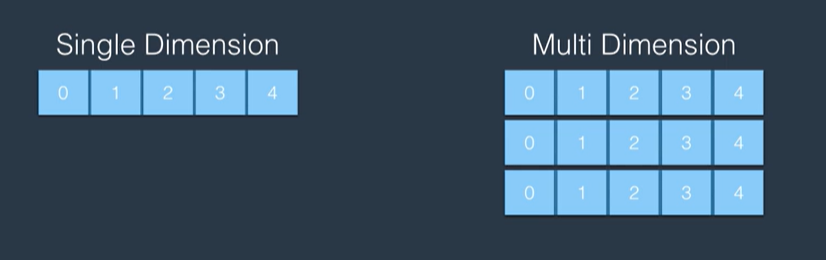
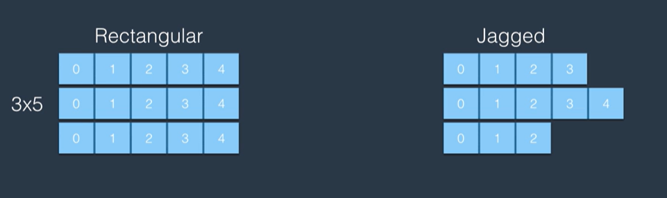

# C#


```csharp
char myChar = 'a';   // single 'quotes' used for data type char
string firstName = "Parker";   // double "quotes" used for data type string
```


## Data Types

### Intro

In C#, types can be either: **primitive/value** type or **non-primitive/reference** type

1. Primitive/Value Type:

   - Primitive types are basic data types built into the C# language.
   - Example `int`
   - When a variable is assigned a primitive/value type, such as an instance of a `struct` or an `int`, it directly stores the actual value of the data within its allocated space on the **stack**. This direct storage means that for any operation on the variable, like assigning it to another variable or passing it as a method parameter, a copy of the value is created.
   
2. Non-Primitive/Reference Type:

   - Non-primitive types are typically defined by the developer or provided by the .NET framework.
   - Example `array`
   - When a variable is assigned a non-primitive/reference type, such as an instance of a `class` or an `array`, this establishes a reference to the data's memory location on the **heap**. Variables of non-primitive/reference types thus don't contain the data itself but rather a pointer to the heap where the data is dynamically managed.
   - When you assign a non-primitive type to another variable or pass it as a method parameter, the reference to the object is copied, not the actual object itself.
   


Example:

```csharp
// Primitive/Value type
int x = 10;
int y = x; // y is assigned the value of x
x = 20; 
Console.WriteLine(x); // 20
Console.WriteLine(y); // 10

// Non-Primitive/Reference type
int[] array1 = { 1, 2, 3 };
int[] array2 = array1; // array2 references the same array as array1

array1[0] = 88; 

Console.WriteLine(array1[0]); // 88
Console.WriteLine(array2[0]); // 88
```


### Primitive/value data types

**C# Type** = **.NET Type** (Stuct)

`byte` = `Byte`

`short` = `Int16`

`int` = `Int32`

`long` = `Int64`

`float` = `Single`

`double` = `Double`

`decimal` = `Decimal`

`char` = `Char`

`bool` = `Boolean`


NOTE for the **real number** types, the default used by the C# compiler is **double**

so if you wan't to declare, for example, float or decimal..

```csharp
float myNum = 1.2f;
decimal myNum = 1.2m;
```


### Non-primitive/reference types

**C# Type** = **.NET Type** (Class)

`string` = `String`

`T[ ]` = `Array`


### Object Browser in VS

All types in C# correspond to a .NET struct or class, for example type `int` corresponds to .NET struct `System.Int32`

This gives us access to the additional properties and methods provided by .NET for that struct/class


In Visual Studio we can view all associated properties and methods of a struct/class using the **Object Browser**

View > Object Browser..

from here you can look up any struct/class, like `System.String` aka `string`, to view all of its associated properties and methods


### Type Conversion

three types of type conversion in C#..

1. Implicit type conversion
2. Explicit type conversion (casting)
3. Conversion between non-compatible types


#### Implicit type conversion

Example: byte to int

```csharp
byte myByte = 200;
int myInt = myByte; // works fine bc the types are compatible and no data loss will occur
																// as int.MaxValue is greater than byte.MaxValue (255)

int myInt = 10;
byte myByte = myInt; // works fine bc the number 10 can be stored as either an int or a byte

int myInt = 256;
byte myByte = myInt; // won't compile bc the int can't be converted to byte (byte.MaxValue = 255) without data loss
```

if you want to convert anyway, despite the known data loss that will happen, you can use Explicit type conversion..


#### Explicit type conversion (casting)

Example:

```csharp
float myFloat = 1.2f;
int myInt = (int)myFloat;
Console.WriteLine(myInt); // 1
```

you can explicitly declare that you would like to convert `myFloat` to an `int` regardless of potential data loss


Example:

```csharp
int a = 10;
int b = 3;
  
Console.WriteLine( (double)a / (double)b ); // 3.333333333
```


#### The .NET Convert class

the `Convert` class, provided by .NET framework, is useful in data type conversion

it offers various methods for data type conversion

```csharp
namespace System
{
    public static class Convert
    {
      
    }
}

// includes methods..
Convert.ToInt32(value);
Convert.ToDouble(value);
Convert.ToString(value);
Convert.ToChar(value);
Convert.ToBoolean(value);
Convert.ToDateTime(value);
etc
```


## Class vs Struct

In C# there are essestially two main constructs we can use to make new types.. structures (structs) and classes.

So all the C# types discussed above are either a Struct or a Class in .NET

In fact all of the primitive types are **structs** in .NET framework

All of the reference types are **classes** in .NET framework


## Struct

Struct is not a data type itself but a construct that allows you to define your own data types and create objects of those types.

Structs are **value types** that contain data members (fields), properties, and methods. They are typically used to represent small, lightweight objects that hold a few related values.

to declare a struct..

```csharp
public struct RgbColor
{
    public int Red;
    public int Green;
    public int Blue;
}
```

similar to classes, structs combine related properties and methods together

and their differences with classes are subtle enough that you may never need them

Structs become advantageous when you want to create simple, small objects like the example of RgbColor, above

Since structs are more lightweight than classes, when you need maybe thousands of instances of an object, a struct may be the more appropriate way to define its properties and methods


### Numbers

Numbers are primative/value type in C# and each C# number data type corresponds to a .NET struct (viewable in VS Object Browser)

#### Number Data Types

```csharp
int intMin = int.MinValue;
int intMax = int.MaxValue;
Console.WriteLine($"int range of {intMin} to {intMax}");
int intOne = 1;
int intThree = 3;
Console.WriteLine($"int 1/3 = {intOne / intThree}");

Console.WriteLine("");

float floatMin = float.MinValue;
float floatMax = float.MaxValue;
Console.WriteLine($"float range of {floatMin} to {floatMax}");
float floatOne = 1;
float floatThree = 3;
Console.WriteLine($"float 1/3 = {floatOne / floatThree}");

Console.WriteLine("");

double doubleMin = double.MinValue;
double doubleMax = double.MaxValue;
Console.WriteLine($"double range of {doubleMin} to {doubleMax}");
double doubleOne = 1;
double doubleThree = 3;
Console.WriteLine($"double 1/3 = {doubleOne / doubleThree}");

Console.WriteLine("");

decimal decimalMin = decimal.MinValue;
decimal decimalMax = decimal.MaxValue;
Console.WriteLine($"decimal range of {decimalMin} to {decimalMax}");
decimal decimalOne = 1;
decimal decimalThree = 3;
Console.WriteLine($"decimal 1/3 = {decimalOne / decimalThree}");
```


```
int range of -2147483648 to 2147483647
int 1/3 = 0

float range of -3.402823E+38 to 3.402823E+38
float 1/3 = 0.3333333

double range of -1.79769313486232E+308 to 1.79769313486232E+308
double 1/3 = 0.333333333333333

decimal range of -79228162514264337593543950335 to 79228162514264337593543950335
decimal 1/3 = 0.3333333333333333333333333333
```


`int` = integer (worst range and no precision)

`float` = for floating point numbers (decent range but worst precision)

`double` = for floating point numbers (biggest range and decent precision)

`decimal` = for floating point numbers (ok range and best precision)


NOTE for `decimal` type you may need to add the `M` suffix to the number at declaration. When compiled, a number without `M`, like `19.99`, will be created and default to either `integer` or `double` *before* being assigned to the variable - and an `int` or `double` can't be converted to `decimal`

So adding `M` tells C# to *create* that number as a decimal (and then it can be assigned to the variable)

```csharp
decimal price = 19.99;  // Error: Cannot implicitly convert type 'double' to 'decimal'
decimal price = 19.99m;  // no error
```


So unless you are doing some work that requires high decimal precision you will almost always use..

`int`

or

`double`


All Number Types:

1. Integral Types:
   - `sbyte`: Signed 8-bit integer (-128 to 127)
   - `byte`: Unsigned 8-bit integer (0 to 255)
   - `short`: Signed 16-bit integer (-32,768 to 32,767)
   - `ushort`: Unsigned 16-bit integer (0 to 65,535)
   - `int`: Signed 32-bit integer (-2,147,483,648 to 2,147,483,647)
   - `uint`: Unsigned 32-bit integer (0 to 4,294,967,295)
   - `long`: Signed 64-bit integer (-9,223,372,036,854,775,808 to 9,223,372,036,854,775,807)
   - `ulong`: Unsigned 64-bit integer (0 to 18,446,744,073,709,551,615)
2. Floating-Point Types:
   - `float`: Single-precision floating-point type (6-9 decimal digits of precision)
   - `double`: Double-precision floating-point type (15-17 decimal digits of precision)
   - `decimal`: Decimal type for precise decimal calculations (28-29 significant digits)
3. Other Numeric Types:
   - `char`: 16-bit Unicode character (represents a single character)
   - `bool`: Boolean type representing true or false
   - `BigInteger`: Arbitrary precision integer (can represent extremely large numbers)


#### Overflow

in C#, if a number variable exceeds the range of it's data type..

```csharp
byte myNum = 255;
myNum = myNum + 1; // 0
```

to prevent this..

```csharp
checked
{
  byte myNum = 255;
  myNum = myNum + 1;
}
```

in this case if overflow were to occur, an execption will be thrown and the program will crash unless you handle the exception

or you could, you know, use a different data type like `int`


## Class

Class is not a data type itself but a construct that allows you to define your own data types and create objects of those types.

Classes are **reference types** that contain data members (fields), properties, and methods.


### Create a Class

To create a class..

```csharp
         public                     class                  Person
// (access modifier)   (class keyword)    (class name)
```

**access modifier** = who can access this class (public makes it accessable anywhere in the app)


to add a property to the class..

```csharp
public class Person
{
    public string Name;
}
```


to add a method to the class..

```csharp
public class Person
{
    public string Name;   // property
  
    public void SayHi()    // method
    {
        Console.WriteLine("Hi, my name is " + Name);
    }
}
```

**void** means the method does not return a value


another example:

```csharp
public class Calculator
{
    public int Add(int a, int b)
    {
        return a + b;
    }
}
```

instead of **void**, the Add method here returns an **int**


### Create Object

An instance of a class is an object..

let's create an object..

```csharp
Person person = new Person( );
```

this creates a new object of class Person() and assigns it to a variable of class Person called person


recall how we created a new string object..

```csharp
string myString = "hi";
```

we can also create a string object using..

```csharp
string myString = new string("hi");
```

but note using the `new` keyword is not necessary when creating a string using a string literal because the language provides implicit support for creating string objects without explicitly invoking a constructor.

Also note string objects are immutable in C#.

An immutable object is an object whose state (the values of its properties) cannot be modified after it is created. Once an immutable object is created, its state remains fixed throughout its lifetime.

Note we are not saying the myString variable is immutable (constant) but rather the string object "hi" is immutable

```csharp
string myString = "hi";
myString = "bye";
```

in this case, the `myString` variable is updated to reference the newly created `string` object which has the value "bye"


ok back to creating an object of user-defined data type (class)..

```csharp
Person person = new Person( );
```

this creates a new object of class Person() and assigns it to a variable of class Person called person


we can clean this up by simply saying..

```csharp
var person = new Person( );
```

this creates a new object of class Person() called person, that C# automatically determines is of class Person

```csharp
person.Name = "Parker";
person.SayHi(); // Hi, my name is Parker
```


### The Static Modifier

note with our calculator class..

```csharp
public class Calculator
{
    public int Add(int a, int b)
    {
        return a + b;
    }
}
```

we would have to 'new up' a calculator object in order to use it's `Add` method


instead we can add the **static modifier** to our method definition within our class..

```csharp
public class Calculator
{
    public static int Add(int a, int b)
    {
        return a + b;
    }
}
```

this means we can access the `Add` method directly from the class (no object needed)

```csharp
int result = Calculator.Add(1, 2);
```


### String

Strings are reference-type (non-primitive)

but they display many of the characteristics of primitive/value type


create a string object and assign it to a variable..

```csharp
string fristName = "Parker";
```


we can concat with `+`..

```csharp
string name = firstName + " " + lastName;
```

or use string.Format()..

```csharp
string name = string.Format("{0} {1}", firstName, lastName);
```

or create a string from an array..

```csharp
int[ ] numbers = {1, 2, 3};
string list = string.Join(",", numbers);
// "1,2,3"
```

string characters can be accessed by index..

```csharp
string name = "Parker";
char firstChar = name[0]; // "P"
```

and because strings are immutable we cannot change individual characters of a string object..

```csharp
name[0] = 'D'; // will not run
name = "Darker"; // is ok
```


Special Characters:

`\n` = new line

`\t` = tab

`\\` = backslash

`\'` = escape single quote

`\"` = escape double quote


note if you have many special characters in a string, you can just use a **verbatim string**..

```csharp
string path = @"c:\projects\project1\folder1";
```

which is prefixed with an `@` symbol

and respects line breaks


### Array

Arrays are reference-type (non-primitive)

A data structure that can hold multiple elements *of the same type*.


to declare an array..

```csharp
int[ ] numbers = new int[3];
```

NOTE in C# arrays have a **fixed size** that must be specified during declaration and **cannot be changed**


we can simultaneously declare and define an array with..

```csharp
int[ ] numbers = new int[3] {1, 2, 3};
```

again we can simplify this by using..

```csharp
var numbers = new int[3] {1, 2, 3};
```

note..

```csharp
int[ ] numbers = {1, 2, 3};
```

is also valid (C# 3.0 and later)


## Enum

In C#, `enum` is a keyword, similar to `class` and `struct`, that is utilized to define custom value types with a set of named constants. While `enum` under the hood inherits from the .NET class `System.Enum`, making it seem class-like, it exhibits behavior more akin to a struct (it is value-type). This means enums are allocated on the stack and passed by value, which aligns them closely with the characteristics of structs rather than reference types like classes. Enums serve to enhance code readability, maintainability, and type safety by allowing developers to work with a predefined set of named integral constants instead of loose numeric values.

An enum represents a set of key/value pairs.

An Enum's key/values pairs are numeric **constants**

So Enums are useful for creating a set of related named **numeric** constants

```c#
public enum FavoriteRgb
{
  Red = 10,
  Green = 120,
  Blue = 230
}

// now can use..

var red = FavoriteRgb.Red;
Console.WriteLine(red); // Red - type is FavoriteRgb
Console.WriteLine((int)red); // 10 - after cast to int

var num = 230;
Console.WriteLine((FavoriteRgb)num); // Blue - after cast to FavoriteRgb
```

The values of the keys in an enum must be numeric and are default **int**, but other numberic types (like byte) can be specified


## Delegate

In C#, `delegate` is a keyword used to define types that represent references to methods with a specific signature. This capability allows methods to be passed as parameters, stored in variables, and invoked dynamically, similar to function pointers in other programming languages. However, unlike function pointers, delegates are object-oriented, type-safe, and secure. Delegates are reference types, and when you create a delegate instance, it holds a reference to a method or a chain of methods (multicast delegates) that can be invoked through the delegate.


## Interface

In C#, `interface` is a keyword used to define a contract or a blueprint for classes and structs. An interface specifies a set of method signatures, properties, events, and indexers without providing implementations. Implementing classes or structs must provide concrete implementations for all members defined by the interface. Interfaces are a fundamental tool for achieving abstraction and enabling polymorphism in object-oriented programming, allowing for flexible and loosely coupled designs.


## Variables

### Intro

Declaring a variable:

```csharp
int number; // declaration - if a variable is only declared and not used, the app will run but warn you about the unused variable
Console.WriteLine(number); // the app will not run - "use of unassigned local variable"
number = 5; // assignment
Console.WriteLine(number) // 5
```

Declaring a constant variable:

```csharp
const int MyConst = 10;
```


variable names..

- cannot start with a number
- cannot be a C# reserved word
- can start with/contain @ like `@int`
- should use **c**amel**C**ase for local variables
- should use **P**ascal**C**ase for constants


The keyword `var` makes variable declaration easier..

```csharp
var myNum = 5;  // the C# compiler will automatically detect and assign an appropriate data type for this variable
```

you can hover over the variable in VS to see which data type will be assigned


### Variable Scope

variables are block scope..

```csharp
{
  byte a = 1;
  {
    byte b = 2;
    {
      byte c = 3;
    }
  }
}
```


## Try Catch

in C# errors are called `exceptions` and these exceptions are what will cause your application to crash

for example..

```csharp
string myString = "1234";
byte myByte = Convert.ToByte(myString);
Console.WriteLine(myByte);

Console.WriteLine("hi");

// Unhandled exception occured
```

will throw an exception, and crash, because "1234" cannot be easily converted to data type `byte` (which has a max value of 255)


you can prevent your program from crashing by handling the exception using a `Try Catch` block..

```csharp
try
{
    string myString = "1234";
    byte myByte = Convert.ToByte(myString);
    Console.WriteLine(myByte);
}
catch (Exception)
{
    Console.WriteLine("That didn't work");
}

Console.WriteLine("hi");

// That didn't work
// hi
```

where you can essentially define custom error code for when the code in the `try` block fails


##  Operators

C# operator types..

1. Arithmetic operators
2. Comparison operators
3. Assignment operators
4. Logical operators
5. Bitwise operatros


### Arithmetic Operators

```csharp
+
-
*
/
%
++ (prefix and postfix)
--   (prefix and postfix)
```


### Comparison Operators

```csharp
==
!=
>
<
>=
<=
```


### Assignment Operators

```csharp
=
+=
-=
*=
/=
```


### Logical Operators

```csharp
&&
||
!
```


## Loops

WHILE

```csharp
int counter = 0;
while (counter < 10)
{
  Console.WriteLine($"counter = {counter}");
  counter++;
}
```

DO .. WHILE

```csharp
int counter = 0;
do
{
  Console.WriteLine($"counter = {counter}");
  counter++;
} while (counter < 10);
```

FOR

```csharp
for (int i = 0;  i < 10;  i++)
{
  Console.WriteLine($"counter = {i}");
}
```

FOR EACH

`foreach` repeats its code for every item in a sequence of items

```csharp
string[] fruits = { "Apple", "Banana", "Orange", "Mango" };

foreach (string fruit in fruits)
{
    Console.WriteLine(fruit);
}
```

NESTED FOR LOOP

```csharp
for (int row = 1;  row < 11;  row++)
{
  for (char column = 'a';  column < 'k';  column++)
  {
    Console.WriteLine($"cell ({row}, {column})");
  }
}
```

BREAK and CONTINUE

`Break` exits the loop

`continue` jumps to the next iteration 

```c#
// break on Orange
string[] fruits = { "Apple", "Banana", "Orange", "Mango" };

foreach (string fruit in fruits)
{
  	if (fruit == "Orange")
    {
        break; // exits the loop
    }
    Console.WriteLine(fruit);
}

// odd numbers only
for (int i = 0; i < 10; i++)
{
    if (i % 2 == 0)
    {
        continue; // jumps to the next iteration
    }
    Console.WriteLine(i); // 1 3 5 7 9
}
```


## If Else Switch

if / else

```c#
if (condition) 
{
  	code
}
else if (anotherCondition)
{
  	code
}
else
{
  	code
}
```

switch

```c#
switch(role)
{
  case Role.Admin:
    	...
      break;
  case Role.Moderator:
    	...
      break;
  default:
    	...
      break;
}
```

ternary conditional

```c#
float price = (isMember) ? 9.99f : 19.99f;
```


## Arrays

All arrays in C# map to `System.Array` class in .NET

Arrays in C# can be **single dimensional** or **multi dimensional**




### Single Dimension Arrays

Single-dimensional arrays store items in a linear form. Each item in the array can be accessed using a single index.

```c#
var numbers = new int[3];
var numbers = new int[3] { 1, 2, 3 };
```


### Multi Dimension Arrays

Can either be **rectangular** or **jagged**




#### Rectangular Arrays

Rectangular arrays have two or more dimensions. Each element in the array is accessed using multiple indexes.

2D:

```c#
var matrix = new int[3, 5]; // 3 rows and 5 columns

var matrix = new int[3, 5]
{
  { 1, 2, 3, 4, 5 },
  { 6, 7, 8, 9, 10 },
  { 11, 12, 13, 14, 15 }
};

var element = matrix[1, 1]; // 7
```

3D: These arrays are essentially a collection of 2D arrays, adding another layer of depth.

```c#
var cube = new int[3, 3, 3];

// 3D arrays do not support direct initialization of values as with 1D and 2D arrays, and must be assigned values like..
cube[0, 0, 0] = 1;
cube[0, 0, 1] = 2;
```


#### Jagged Arrays

Jagged arrays are arrays of arrays. Each "sub-array" can have a different size. You can think of a Jagged Array as simply a single-dimension array containing other single-dimension arrays.

```c#
var myArray = new int[3][]; // we use two square brackets to initialize a jagged array

// now we initialize three new arrays to go inside..

myArray[0] = new int[4];
myArray[1] = new int[5];
myArray[2] = new int[3];

myArray[0][0] = 22; // again we use two square brackets to access elements, rather than [0, 0]
```


## Lists


## Lambda Expression

In C#, a lambda expression is a concise way to define anonymous functions. Lambda expressions allow you to create inline functions without explicitly declaring a separate method. They are commonly used in functional programming, LINQ queries, and event handling.

Lambda expression syntax:

```csharp
(parameter_list) => expression_or_statement_block
```

```csharp
Func<int, int, int> add = (a, b) => a + b;
int result = add(3, 4);  // result = 7
```


