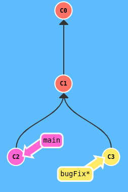
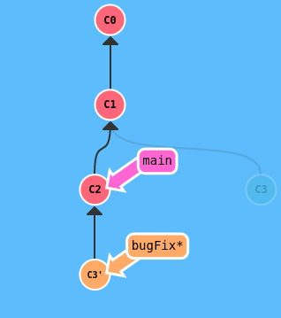
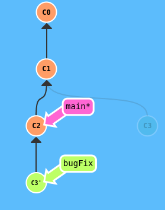
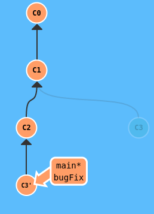

# Git and GitHub - Using

IT IS ADVISED to make any changes via your local files then commit and push them using Git commands in your terminal - do not edit things on GitHub!

### Create New Repo

GitHub -> New repository -> give it a name -> add a README -> Create repository

**clone** the repository (use the SSH url from the repo on GitHub) with..

`git clone git@github.com:USER-NAME/REPOSITORY-NAME.git`

you can now create/edit files in this local copy of the repo

`git remote -v` displays the URL of the remote repo (GitHub)

### GitHub Pages

GitHub allows you to publish your project directly from GitHub so that it can be reached at..

`your-github-username.github.io/your-github-repo-name`

Make sure the main HTML file of your project is called `index.html` (if not, change it)

From the desired GitHub repo on the web, `Settings > Pages > Branch = main branch > Save`

It may take up to 1 hour to publish - DO NOT add a 'theme' to your project or you may have git conflicts

This seems to only work for static sites (you cannot host a server on GitHub)

### Basics

`HEAD` is the symbolic name for the currently checked-out commit - it is the commit you are currently working on top of

**Atomic Commits** try to make commits that include changes related to only **one** feature or task of your program

*note: if you get a message that says `“upstream is gone”` this is normal and only shows when your cloned repository currently has no branches.

`git status`

`git add file.txt` add file.txt to the staging area

`git add .` add all items in `.` to the staging area

`git commit -m "Added file.txt"` commit to your local repo with commit message (-m)

`git commit` is currently configured to open in VSCode - use to add a longer message

`git log` display all past commits (can pipe through `less`)

`git push origin main` upload your work to the GitHub remote (origin) repo - specifically the (main) branch

### Branches

#### Intro

**branches** in Git allow your repo to hold multiple *alternate* versions of your project

all the branches stem off a central trunk (the `main` branch) or off of *other* branches

you can keep your `main` branch as a place for finished features only - those known to be working properly

and add each feature to your project using dedicated branches we call *feature branches* 

`git branch` display all branches

`git branch <branch_name>` will create a new branch

`git checkout <branch_name>` to switch to `<branch_name>` - aka change the working branch

`git checkout -b <branch_name>` simultaniously creates a new branch and switches to it

you just do your normal commiting and everything in the new branch - then you can push it to GitHub with

`git push origin <branch_name>`

or

`git push -u origin <branch_name>` will automatically link the local branch with the remote one

and from then on you can just use `git push`

#### Merge

once you are done working on your feature branch and you want to add those commits to your `main` branch..

`git merge <branch_name>` will take the changes you've comitted in `<branch_name>` and add them to the working branch

so you need to be on branch `main` when you do this

note if, for example, the same lines in a file have been changed in two different branches

you will have a merge conflict if you try to merge these branches together

you will have to resolve the conflict first (covered in TOP later)

#### Delete Local

to delete branches - first move off the branch you wish to delete, then..

`git branch -d <branch_name>` will delete the branch locally - use when the branch has already been merged into `main`

`git branch -D <branch_name>` will delete the branch locally - use when the branch is no longer needed, and hasn't been merged into `main`

it is actually good practice to delete branches when you're done with them, otherwise they can pile up and clutter the project

#### Delete Remote

`git branch -a` display all branches (including remote)

`git branch -r` display remote branches

`git push origin -d <branch_name>` will delete the branch from GitHub - yes, you delete the remote and local seperately

#### Rebase

the second way of combining work between branches is rebasing

rebasing essentially takes a set of commits, **copies** them, and plops them down somewhere else

the advantage of **rebasing**, over **merging**, is that it can be used to make a nice linear sequence of commits

the git log will be much cleaner if only rebasing is allowed

say you have work on the `main` branch and a `feature` branch

if you **merge** `feature` into `main`, the commits in the git log will be ordered by edit time/date, and therefore may be mixed

if you instead **rebase** `feature` onto `main` - it will look as though the work was done sequentially, when in reality the work on `main` and `feature` was done in parallel 

to **rebase** `<branch_name>` onto `main` - while on branch `<branch-name>` use..

`git rebase main` to apend branch `<branch_name>` to main - but now we should bring main to the front too so

checkout `main` then use

`git rebase <branch_name>`

|  |  |  |  |
| ------------------------------------------------------- | --------------------------------------------- | --------------------------------------------- | --------------------------------------------- |

pro tip: use `git rebase -i <branch_name>` to rebase onto another branch **interactively** - this will allow you, through VSCode, to change commit messages, even amend commits!

so you can actually amend a previous commit by using **Force** (described below) to force main behind the commit you want to ammend

and then rebase (interactively) everything back onto main - amending the disired commit in the process - it's actually pretty easy even if the desired commit is far back in the tree

but probably not recommended if working on a shared repo that has already been pushed to GitHub

Pro Tip: constantly doing you work on a feature branch, and constantly `git rebase -i main` - this will update your feature branch to include any changes that may have been made to main - while also giving you chance to clean up the commits of your feature branch

#### Sharing a Branch

another use for branches is to share code with others - for example..

if you have a bug in a new feature you're working on that you can't figure out

instead of commiting the current state, as is aka broken, so that you can push it to GitHub and share it with someone

you can create a new temporary branch, commit everything in this new branch and then push it to GitHub for sharing

### Detached Head

recall `HEAD` is the symbolic name for the currently checked-out commit - it is the commit you are currently working on top of

usually HEAD points to a branch name (like bugFix) but it can also point to individual commits

attaching HEAD to a commit, rather than a branch, is called **Detached HEAD**

so it is when HEAD points to a commit..

HEAD -> 4adfs765fad765

instead of a branch..

HEAD -> main -> 789a7fd897aa8fd

### Relative Refs

we use `git log` to see commit hashes

we can then use hashes to reference commits in a number of commands

note we don't have to write the whole hash!

Git only requires you to specify enough characters to uniquely identify the commit

or we can use **relative refs**

where using `^` means "the parent" of whatever `^` is attached to like..

`git checkout main^`

means checkout the commit which is the parent of `main`

or use..

`git checkout HEAD^`

which would checkout the parent of whatever commit you currently have checked out!

or use..

`git checkout HEAD~4`

which would checkout the commit 4 commits back

note `HEAD^ = HEAD~1`

### Reversing Changes

there are a few ways to undo changes in Git - **revert**, **reset**, and **force**

#### Revert

`git revert` makes a new commit which exactly reverses the commit we want to revert

Syntax: while on the branch you want to add a revert to..

`git revert <hash to revert>`

for example `git revert HEAD` would create a revert commit that reverts the HEAD commit

#### Reset

**Reset and keep untracked/modified files**:

`git reset` works by moving the current branch backwards to an older commit

but **keeps all changes** from the 'reseted' commits as untracked/modified

so in this way you can rework those edits and make new commits with them

while reseting works ok for local work on your own machine..

its method of "rewriting history" simply does not work for remote repos - actually it doesn't really work well in general

and so `git reset` SHOULD NOT be used to alter work that has already been pushed to the remote

Syntax: while on the branch you want to move..

`git reset <hash to move to>`

for example `git reset HEAD^` would move one commit back - aka delete the HEAD commit

#### Force

**Reset and keep untracked/modified files as a branch**:

If you wish to **reset** the last few **local** changes (**do not use** to alter work that has already been pushed to remote)

Locate the commit you want to reset back to:

Use `git checkout <hash>` to checkout a previous version of the project

If this is the correct target commit - go back to main with `git checkout main` and create a new branch that describes

the edits that took place after the target commit with `git checkout -b <new_branch>`

now we will force the main branch to the target commit

`git branch -f main <hash>`

and now we can continue on our way

commiting to main as if we meant to make the bugFix a seperate branch in the first place!

we can delete bugFix with `git branch -D bugFix` if we want - but maybe just keep it in case you want to merge or rebase the feature later

OF COURSE if you would like to alter the remote of a repo you work on **alone** that no-one has forked or used.. you can do pretty much whatever you want to the local and then use:

`git push -f origin main`

### Extra Stuff

#### Cherry-pick

`git cherry-pick` - rebase (add) any commit to the current branch

Syntax, when on the branch you want to add to..

`git cherry-pick <hash> <hash> <hash>`

#### Git Tags

Git tags somewhat permanently mark certain commits as 'milestones' - think big releases, versions, etc

you can then reference these tagged commits like a branch - you can't work on them like a branch - they are just a labeled commit

`git tag version1 <hash>`

for example `git tag new-theme HEAD`

#### Git Describe

because tags serve as such great 'anchors' in the codebase, git has a command to describe where you are relative to the closest tag

`git describe --tags <ref>`

will return..

`<tagName>-<numCommitsAway>-g<abbreviated hash of ref>`

for example, if I am on commit `5e2dc1dd1ee0539c1a66a9d2c96b780822a9f784` and I use

`git describe --tags HEAD`

I might get..

`v1.0.4-4-g5e2dc1d`

which means the commit starting with `5e2dc1d` (HEAD) is 4 commits ahead of tag `v1.0.4`

ok
