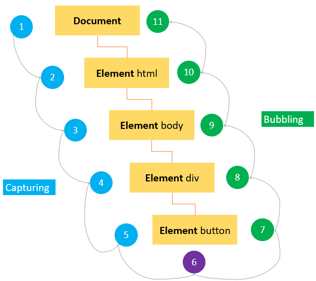

# JavaScript

## Adding JS to HTML

there are two **ways** you can add JavaScript to HTML

you can insert the code directly in a script tag..

```html
<script>
  // Your JavaScript code
  console.log("Hello, World!");
</script>
```

or you can link a JavaScript file..

```html
<script src="javascript.js"></script>
```


there are three **places** you can add JavaScript to HTML

in the **head**

```html
<head>
    <script src="javascript.js"></script>
</head>
```

in the **body** - at the beginning

```html
<body>    
    <script src="javascript.js"></script>
    <!-- all the html elements -->
</body>
```

in the **body** - at the end

```html
<body>
    <!-- all the html elements -->
    <script src="javascript.js"></script>
</body>
```


How a browser loads a webpage containing `<script>` tags:

1. Fetch the HTML page (ex: *index.html*)
2. Begin parsing the HTML
3. The parser encounters a `<script>` tag referencing an external script file - and pauses parsing the HTML
4. The browser requests the script file
5. After some time the script is downloaded and subsequently executed
6. The parser continues parsing the remaining HTML

Step #3 causes a bad user experience. Your website basically stops loading until you've downloaded all scripts.


JavaScript scripts can insert and manipulate DOM elements - the browser doesn't know whether this script is going to do that - so it downloads and executes the script before continuing to parse the HTML document

but most JavaScript developers no longer manipulate the DOM *while* the document is loading


you will often see `<script>` tags at the bottom of the `<body>` as this was the old solution to this problem - let the HTML parse fully before touching the scripts

but this isn't the best for performance - and ideally we would want to start downloading the scripts immediately


the `async` and `defer` attributes on the `<script>` tag solve this

scripts with either `async` or `defer` are downloaded when they are encountered - without pausing the HTML parse


**async**

```xml
<script src="script1.js" async></script>
<script src="script2.js" async></script>
```

`async` scripts execute as soon as they download - HTML parsing is paused during execution

note that it's possible script 2 is downloaded and executed before script 1


**defer**

```xml
<script src="script1.js" defer></script>
<script src="script2.js" defer></script>
```

`defer` scripts execute after the entire document has loaded - so there is nothing to pause at this point

note that `defer` scripts are executed in order (first script 1, then script 2)


**SUMMARY** - you should put scripts in the `<head>` so that they are downloaded ASAP

and use the `defer` attribute so that they don't block your browser from parsing HTML

`defer` is the most reliable method of adding JavaScript to HTML for modern browsers

[HELPFUL VISUAL](https://www.growingwiththeweb.com/2014/02/async-vs-defer-attributes.html)


## Consistent Formatting

When writing a JavaScript application, ensuring consistent formatting and adhering to best practices can be achieved through several tools and style guides.

1. Use an **.editorconfig** file to help maintain consistent coding styles for multiple developers working on the same project across various editors and IDEs.
2. **ESLint** is a popular linter for JavaScript. ESLint helps in identifying and reporting on patterns found in ECMAScript/JavaScript code, with the goal of making code more consistent and avoiding bugs. It's highly configurable, allowing you to customize rules or use presets from popular style guides.
3. **Prettier** is an opinionated code formatter that supports many languages, including JavaScript. It enforces a consistent style by parsing your code and re-printing it with its own rules, wrapping code when necessary.
4. **Style Guides**:
   - [Airbnb JavaScript Style Guide](https://github.com/airbnb/javascript) - one of the most popular JavaScript style guides
   - [Google JavaScript Style Guide](https://google.github.io/styleguide/jsguide.html) - another popular JavaScript style guide
   - [StandardJS](https://github.com/standard/standard) - an opinionated style guide with a linter and automatic code formatter


[The Odin Project Linting](https://www.theodinproject.com/lessons/node-path-javascript-linting)


## Variables

#### Let

we use variables to store data..

`let` - is a modern variable declaration - it is still relatively new!

`const` - is like `let` but the value of the variable can’t be changed - also still relatively new!

`var` - is an old-school variable declaration - i won't use it - but `var` will appear in lots of the tutorials and code accross the web

variable **declaration** refers to the **creation** of a variable

variable **definition** refers to the **assignment** of a value to a variable

```javascript
let message; // declares message - creates a variable called message
message = 'Hello'; // defines message - assigns the value (string) 'Hello' to message

// or

let message = 'Hello'; // declare and define message more concisely

alert(message); // prints the variable's value in a pop-up on the webpage

// we can re-define a variable as many times as we want

message = 'Hello';
message = 'Goodbye';
message = 'the end';
```

```javascript
// declare and define multiple variables at once = not recommended (messy code)

let user = 'John', age = 25, message = 'Hello';

// instead use..

let user = 'John';
let age = 25;
let message = 'Hello';
// or
let user = 'John'
  , age = 25
  , message = 'Hello';
```

```javascript
// define a variable using another variable..

let hello = 'Hello world!';
let message = hello;

alert(hello); // Hello world!
alert(message); // Hello world!
```

```javascript
// repeated 'let' leads to an error..

let message = "This";
let message = "That"; // SyntaxError: 'message' has already been declared
message = "That"; // is ok
```

NOTE JavaScript **variable names**..

- can contain only letters, numbers, `$`, and `_`
- cannot start with a number
- cannot be those words used by JavaScript itself like.. `let` `class` `return` `function` etc
- are CaSe SenSitiVe --> camelCase is often used

camelCase --> starts lowercase and then each word's first letter is capitalized

NOTE we cannot define a variable if the variable has not yet been declared - this didn't used to be the case though, and so there is a setting called `"use strict"` which allows for compatiblity with old scripts..

 ```javascript
// "use strict";  (is off)

num = 5; // the variable "num" is created if it didn't exist
 ```

```javascript
"use strict";   // (is on)

num = 5; // error: num is not defined
```


#### Const

we can declare a variable to be unchanging (constant)..

```javascript
const myBirthday = '18.04.1982';

myBirthday = '01.01.2001'; // error, you can't reassign a constant
```

used when a developer is sure a variable will never change - and wants to clearly communicate that

NOTE..

there is a widespread practice of using constants as aliases for difficult-to-remember kown values

this practice uses **capital letters** and **under_scores** for such cases

example for hard-to-remember color names..

```javascript
const COLOR_RED = "#F00";
const COLOR_GREEN = "#0F0";
const COLOR_BLUE = "#00F";
const COLOR_ORANGE = "#FF7F00";
```

NOTE this convention (capital letters and underscores) should only be used for **constants** with **values known before execution** (just a good practice)

otherwise use camelCase as with `let` variables..

```javascript
const pageLoadTime = /* time taken by a webpage to load */;
```

the value of `pageLoadTime` is not known prior to the page load, so it is named normally - but it is still a constant because it doesn’t change after assignment


#### Chaining (not recommended)

you can actually chain assignments

```javascript
let a, b, c;

a = b = c = 2 + 2;

alert( a ); // 4
alert( b ); // 4
alert( c ); // 4
```

chained assignments evaluate from **right to left** - this is not very readable code though - you should prioritize readability (define each variable on its own line)


#### Naming Things Well

some good-to-follow rules..

- use human-readable names like `userName` or `shoppingCart`
- stay away from abbreviations or short names like `a`, `b`, `c` (unless you're experienced)
- make names **maximally** **descriptive** but **concise**
- bad names like `data` and `value` say nothing - it’s only okay to use these if the context of the code makes it obvious which data or value the variable is referencing
- agree on terms within your team and in your own mind - if a site visitor is called a “user” then we should name related variables `currentUser` or `newUser` instead of `currentVisitor` or `newManInTown`

also apparently it's better to define more variables than less (aka don't reuse variables just bc you are lazy)


## Numbers

### Types

**Integers** are whole numbers

**Floating point numbers** or **floats** have a decimal point, for example 12.5 or 56.23084

**Doubles** are a specific type of floating point number that is accurate to a greater number of decimal places


types of number systems..

**Decimal** is base 10 meaning it uses digits `0-9`

**Octal** is base 8 meaning it uses digits `0-7`

**Binary** is base 2 - the lowest level of language for computers - uses digits `0` and `1`

**Hexadecimal** is base 16 and uses digits `0-9` and letters `a-f` (recall the Hexadecimal color names in CSS)


### Operations

these symbols are called **operators**:

`+` addition

`-` subtraction

`*` multiplication

`**` exponentiation

`/` division

`%` modulus (remainder)

`++` increment

`--` decrement


a javascript arithmetic operation can involve numbers and/or variables.. these numbers/variables are called **operands** (or **arguments**)

```javascript
let x = 100 + 3.14;
let y = a + b;
let z = (100 + 50) * a;

let x = 123e5; // 12300000
let y = 123e-5; // 0.00123
```

**never** write a number with a leading zero (like 07) --> but with decimals it is ok (like 0.007)


an **operator** is *unary* if it operates on a single operand --> for example negation `-` reverses the sign of a number

```javascript
let x = 1;

x = -x;
alert( x ); // -1, unary negation
```

an **operator** is *binary* if it operates on two operands --> for example subtraction `-` is binary

```javascript
let x = 1
  , y = 3;
alert( y - x ); // 2, binary subraction
```

above is an example of two different operators which share the same symbol


note operations between integers (numbers without a decimal) is accurate - but when a decimal is involved it isn't really accurate wtf

```javascript
let x = 0.2 + 0.1;

alert(x); // displays 0.30000000000000004 (see Rounding, below)
```


every operator in javascript has a corresponding precedence number - the operator with the larger number executes first - if the precedence is the same, the execution order is from left to right - [Precedence Table](https://developer.mozilla.org/en-US/docs/Web/JavaScript/Reference/Operators/Operator_Precedence#table) link


note **all operators** return a value, even `=` (assignment) returns the value of the assignment

```javascript
let x;
x = 10; // returns the value of x (10)

x; // also returns the value of x (10)

// note, using 'let' in the console returns a syntax error so..
let x = 10; // does not return anything or returns 'undefined'
```


```javascript
let x = "74";

typeof x; // will return 'string'

Number(x) // returns x converted to data type 'number'
+x        // does same as Number(x)

alert( +true ); // returns 1 (with data type number)
alert( +false ); // returns 0 (with data type number)

alert( +1 ); // returns 1 (does nothing)
alert ( +(-2) ) // returns -2 (does nothing) because unary addition does not affect numbers (only strings)

let x = "74";
+x; // returns 74 (with data type number)

let x = "turtle";
+x; // returns NaN (with data type number)

let apple = "2";
let orange = "3";
alert( apple + orange ); // "23"
alert( +apple + +orange ); // 5
alert( Number(apple) + Number(orange) ); // 5
```


the binary **addition** operator `+` is used for both numbers (addition) and strings (concatenation)

```javascript
let x = '10';
let y = '20';

alert(x + y); // displays 1020

let x = 10;
let y = '20';

alert(x + y); // displays 1020 again - if a string is added to a number --> JS concatenates

// note JS works from left to right so..
let x = 10;
let y = 20;
let z = '30';
let result = x + y + z; 

result; // returns 3030
```


BUT if strings are combined using any other operator (other than `+`) then JS will convert strings to numbers

```javascript
let x = '100';
let y = '10';
let z = x / y;

z; // returns 10

// same as..
let x = 100;
let y = '10';
let z = x / y;

z; // returns 10
```

```javascript
// when a string isn't a number..
let x = '100';
let y = 'apple';
let z = x / y;

z; // returns NaN (not a number)
```

```javascript
NaN /* behaves just like a number, meaning it will be used in operations, but the result
       of any operation will also likely be NaN */

let x = NaN;
let y = '5';

alert(x + y);  // displays NaN5 (concatenates)
```

```javascript
let x = 2 / 0;

x; // returns Infinity (for anything divided by zero)

Infinity /* behaves just like a number, meaning it can be used in operations, but the result
            of any operation will also likely be Infinity, -Infinity, or 0 */
```

```javascript
// when strings are combined using any operator (other than +) JS will convert strings to numbers, and..

an empty string "" becomes 0
true becomes 1
false becomes 0
null becomes 0
undefined becomes NaN
```


the **modulus** operator `%` returns the division remainder..

```javascript
let x = 5;
let y = 2;
let z = x % y;

z; // returns 1
// note the division of two integers produces a quotient and a remainder
```


the **increment** operator `++` increments numbers

```javascript
// postfix increment

let x = 10;

x++; // returns the value of x (10) and then assigns a new value to x of (x + 1)

x; // will now return 11
```

```javascript
// prefix increment

let x = 10;

++x; // assigns a new value to x of (x+1) and then returns the value of x (11)
```

same goes for the decrement `--` operator

note..

```javascript
let apple = 1;
let x = ++apple;

x; // returns 2
apple; // returns 2
```

```javascript
let apple = 1;
let x = apple++;

x; // returns 1
apple; // returns 2
```


the **exponentiation** operator `**` applies an exponent

```javascript
let x = 5;
let z = x ** 2;

z; // returns 25

// alternatively you might see..
let x = 5;
let z = Math.pow(x,2);
```

```javascript
4 ** (1/2) // is the square root of 4
```


NOTE javascript follows standard **order of operations**..

```javascript
let x = (100 + 50) * 3; // is not the same as..
let x = 100 + 50 * 3;
```


### Type-safe a function

Since `NaN` is of data type `number` you can type-safe a function which expects a number with..

```javascript
function someFunc(num) {
    if (typeof num === "number" && !Number.isNaN(num)) {
      // do something
    }
}
```


### Rounding

JavaScript floating point numbers and the infamous rounding errors..


<u>Why</u>:

```javascript
const num = 0.1 + 0.2 // 0.30000000000000004
```

All numbers in JavaScript are stored as floating point numbers in memory

That is, every number is converted to scientific notation like.. 1.2345 * 10^25

And stored using up to 64 bits of binary memory for each number.. 

- One bit for the sign (+ or -)
- 11 bits for the exponent
- 52 bits for the fraction (1.2345)

This is because computer memory is limited, so computers cannot store numbers with infinite precision

so to store 1/10 which to humans is simply 0.1 (decimal number system)

a computer actually stores this as 0.0001100110011--repeated (binary number system)

So the question was how many digits should be used to store this number in memory?

And again that answer is 64 bits as detailed above

and so just like when humans add 1/3 + 1/3 + 1/3 but without using fractions so..

0.3333 + 0.3333 + 0.3333 = 0.9999

when a computer adds something like 0.1 + 0.2 we may get something like 0.30000000000000004

Also note JavaScript doesn’t have a concept of different number data types like integer, float, and double like some other languages do

All numbers in JavaScript are of data type `number`

Even `NaN` and `Infinity` are stored as floating point numbers with data type `number`


<u>Comparing Numbers</u>:

If you want to compare two numbers to see if they are exactly equal but ignore rounding errors..

The most commonly accepted practice is to use a tiny “rounding error” value as the tolerance for comparison.

This tiny value is often called “machine epsilon”, which is commonly 

`2.220446049250313 x 10^-16` for `numbers` in JavaScript

`Number.EPSILON` is predifined with this tolerance value so..

```javascript
function numbersCloseEnoughToEqual(n1, n2) {
  return Math.abs(n1 - n2) < Number.EPSILON
}

var a = 0.1 + 0.2
var b = 0.3

numbersCloseEnoughToEqual(a, b) // true
numbersCloseEnoughToEqual(0.0000001, 0.0000002) // false
```


<u>How To Fix</u>:

Note the below solutions can be used also with..

```javascript
Math.round(); // round to the nearest integer
Math.floor(); // round down to the nearest integer
Math.ceil(); // round up to the nearest integer
```


**SIMPLE ROUNDING**

`Math.round()` rounds to the nearest integer

and we can use a bit of math to get any precision we want..

```javascript
let num = 1.2345;
Math.round(num * 10) / 10; // 1.2
Math.round(num * 100) / 100; // 1.23

let num = 12345
Math.round(num / 10) * 10 // 12350
Math.round(num / 100) * 100 // 12300
```

but this method is still subject to **rounding errors** and so doesn't fix anything

but is still widely used because it is quick and, in practice, often good enough

```javascript
Math.round(0.145 * 100) / 100; // returns 0.14

// because
0.145 = 0.14499999999999998 // in JavaScript
```

NOTE this is the **fastest** method in terms of processing time - orders of magnitude faster than the following methods


**BETTER ROUNDING**

Many solutions have been proposed over the years, ranging from simple to highly complex

The simplest is to represent numbers using *exponential notation*

```javascript
Number(Math.round(0.145 + 'e2') + 'e-2') // 0.15 Yay!
```

Which actually fixes everything!

```javascript
Number(Math.round(1.005 * 100) / 100) // 1.00
Number(Math.round(1.005 + 'e2') + 'e-2') // 1.01
```

and can be implemented with the function..

```javascript
function roundAccurately(num, precision) {
    return Number(Math.round(num + 'e' + precision) + 'e' + precision * -1)
}

roundAccurately(1.005, 2) // 1.01 Yay!

roundAccurately(12345, -2) // 12300
```


**ROBUST ROUNDING**

A robust solution has been made into an npm package so you don't have to bloat your js file with such a big function

[LINK](https://www.npmjs.com/package/expected-round)

```javascript
// Round
Math.round10(55, 1);       // 60
Math.round10(-55, 1);      // -50
Math.round10(1.005, -2);   // 1.01
Math.round10(-1.005, -2);  // -1.01
// Floor
Math.floor10(55.59, -1);   // 55.5
Math.floor10(-55.51, -1);  // -55.6
Math.floor10(59, 1);       // 50
Math.floor10(-51, 1);      // -60
// Ceil
Math.ceil10(55.51, -1);    // 55.6
Math.ceil10(51, 1);        // 60
Math.ceil10(-55.59, -1);   // -55.5
Math.ceil10(-59, 1);       // -50
```


**OTHER SOLUTIONS**

you can also use `.toFixed()`..

```javascript
let num = 1.005;

num.toFixed(2) // "1"

parseFloat(num.toFixed(2)) // 1
```

this method is **not a best practice** becuase it still comes with the same rounding errors

associated with `Math.round()` yet is **slower**


NOTE truncation does not introduce rounding errors..

```javascript
Math.trunc(); // returns the integer portion of a number
```


and here is another decent SOLUTION: that doesn't work??

```javascript
function round(value, precision) {
  let multiplier = 10 ** (precision || 0);
  return Math.round(value * multiplier) / multiplier;
}

round(12345.6789, 2) // 12345.68
round(12345.6789, 1) // 12345.7

round(12345.6789) // 12346 - default will round to whole number (precision 0) 

round(12345.6789, -1) // 12350 - can round to nearest 10, 100, etc
round(12345.6789, -2) // 12300

round(-123.45, 1) // -123.4 - handles negative numbers correctly
round(123.45, 1) // 123.5

round(456.701, 2).toFixed(2) // "456.70" - combine with toFixed to format consistantly as a string
```


## Operators

some useful operations that can be performed on numbers..

```javascript
// ASSIGNMENT OPERATORS are shortcuts for defining variable values..

let x = 10;

x = x + 4;  // normal
x += 4;     // shortcut - assigns a new value to x of (x+4) and then returns the new value of x

x = x - 3;  // normal
x -= 3;     // shortcut

x = x * 3;  // normal
x *= 3;     // shortcut

x = x / 5;  // normal
x /= 5;     // shortcut

// example..

let x = 3;
let y = 4;
x *= y; // returns the value of x (12)
```

```javascript
// COMPARISON OPERATORS evaluate the statement and return TRUE or FALSE

5 === 2 + 3 // strictly equal - the values are strictly identical - considers data type

5 == 2 + 3 // loosely equal - not as strict - does not consider data type

5 !== 2 + 3 // strictly not equal - the values are strictly not identical - considers data type

5 != 2 + 3 // loosely not equal - not as strict - does not consider data type

// to help with ! imagine replacing '!' with '=' and then find the answer - then opposite

6 < 10 // less than - the left value is less than the right

10 > 6 // greater than - the left value is greater than the right

6 <= 10 // less than or equal to

10 >= 6 // greater than or equal to
```

```javascript
// BITWISE OPERATORS

wont need these - read if bored..
```

Bitwise operators: https://javascript.info/operators#bitwise-operators

```javascript
// COMMA OPERATOR is one of the rarest operators - but we should understand it in case it comes up

// the comma operator allows you to evaluate several expressions, seperated by commas, each is evaluated but only the result of the last one is returned

let a = (1 + 2, 3 + 4); // note comma has a very low precedence and parentheses should always be used

a; // returns 7
```


## Data Types

every value in javascript has a data type

there are many data types

javascript variables are not limited - they can hold any of the data types

and we can change a variable's data type at any moment

```javascript
let message = "hello";
message = 123456;
```

**programming languages** that allow such things, such as javascript, are said to be **dynamically typed**

**dynamically typed** means there exists data types - but variables are not bound to any of them

note doing math in javascript is "safe" meaning the script will never stop with a fatal error (die), at worst we'll get `NaN`


There are **8 basic data types** in **JavaScript**

- Seven **primitive** data types:
  - `number` for numbers of any kind: integer or floating-point, integers are limited by `±(2^53-1)`
  - `bigint` for integer numbers of arbitrary length
  - `string` for strings - a string may have zero or more characters
  - `boolean` for `true`/`false`
  - `null` for unknown values - a standalone type that has a single value `null`
  - `undefined` for undefined values - a standalone type that has a single value `undefined`
  - `symbol` for unique identifiers
- And one **non-primitive** data type:
  - `object` for more complex data structures

​	

### Number

```javascript
// TYPE 1 - Number - for integers and floating point numbers (also Infinity, -Infinity, and NaN)

let n = 123;
n = 12.345;
```

javascript has **only one** data type for **all numbers**.. both integers and floats are data type `number`

note in javascript the `number` data type does not accurately represent integer values outside of the range..

`-(2^53 - 1) to (2^53 - 1)` 

`-9007199254740991 to 9007199254740991` (note this is a 16 digit number)

outside of this range there will be precision errors

because only so many digits fit into the fixed 64-bit storage

and therefore an approximate value may be stored

--> avoid using **integers** larger than **15 digits** and you should be good

--> avoid using more than **16 digits** when a decimal is present

```javascript
let x = 123456789123456;   // 15 digits --> is ok
let y = 123456789123456.7;  // 16 digits with a decimal --> is ok
let y = 123456789.1234567;  // 16 digits with a decimal --> is ok
```


### BigInt

```javascript
// TYPE 2 - BigInt - was created to store larger integers!

// simply append 'n' at the end of a large integer
const bigNumber = 1234567890123456789012345678901234567890n;

bigNumber; // returns 1234567890123456789012345678901234567890n
typeof bigNumber; // returns bigint

```


### String

Note: a **method** is a bit of functionality that is built into the language or into specific data types

for example JavaScript **string methods** are a bunch of things you can do with strings

```javascript
// TYPE 3 - String - is surrounded by quotes

let str = "Hello"; // 'single' and "double" quotes have the same functionality in javascript
let str2 = 'Hello';
let phrase = `why ${str} how do you do?`; // backticks

// backticks can be thought of as 'extended functionality quotes' in javascript
// they allow you to embed variables and expressions within a string

let name = "John";
// embed a variable
alert(`Hello, ${name}!`); // Hello, John!
// embed an expression
alert(`the result is ${1 + 2}`); // the result is 3
```

**escaping characters** in a string..

```javascript
const singleQuotes = 'I\'ve got no time!' // use a backslash \ to escape special characters
const doubleQuotes = "They called me \"the turtle\" back then."
```

as we saw before, to join strings together (**concatenate**) in javascript we use a type of string called a **template literal**

which is just a string which uses backticks instead of quotes..

```javascript
const one = "Hello, ";
const two = "how are you?";
const joined = `${one}${two}`;
joined; // "Hello, how are you?"
```

you can also **concatenate** strings with `+`

```javascript
const greeting = "Hello";
const name = "Chris";
greeting + ", " + name; // "Hello, Chris"
```

but **template literals** usually give you more readable code..

```javascript
`${greeting}, ${name}`; // "Hello, Chris"
```

note **template literals** respect line breaks..

```javascript
const multipleLines = `I like this song.
It is very hip.`;

multipleLines; /* I like this song.
				  It is very hip. */
```

to generate the equivalent output using normal quotes you would have to include line break `\n` characters..

```javascript
const multipleLines = "I like this song.\nIt is very hip.";

multipleLines; /* I like this song.
				  It is very hip. */
```


### Boolean

```javascript
// TYPE 4 - Boolean (logical) - has only two values: true and false

/* user checks a checkbox */
let checkBoxChecked = true;
typeof checkBoxChecked; // returns boolean

4 > 1; // returns true (boolean)
```


### Null

```javascript
// TYPE 5 - Null - the value 'null' is the only value with data type 'null'

let age = null; // this is simply stating that age is unknown

// null simply represents "nothing", "empty", or "value unknown" - it's like a placeholder

typeof null; // returns 'object'

// which is an officially recognized error in typeof, coming from very early days of JavaScript and kept for compatibility - null is not an object - it's a special value with a separate type of its own - the behavior of typeof is wrong here
```


### Undefined

```javascript
// TYPE 6 - Undefined - the value 'undefined' is the only value with data type 'undefined'

let x;
x; // returns "undefined"
typeof x; // returns "undefined"

// undefined simply means "variable is not defined"
```


### Object

The **object** data type is used to store **collections** of data and more complex entities

**All other** data types are called **primitive** bc their values can contain only a **single thing** (string, number, expression, etc)

```javascript
// TYPE 7 - Object - we'll deal with these later


```


### Symbol

```javascript
// TYPE 8 - Symbol - used to create unique identifiers for objects - more later..


```


### Function

```javascript
// TYPE 9 - well not really a type - Function

typeof alert // returns function

// while 'alert' is a function - there is no javascript data type called function - as functions are data type 'object' - the behavior of typeof is again wrong here
```

**functions** are data type **object**


## Comparisons == != > <

we already know the comparison operators..

```javascript
// COMPARISON OPERATORS evaluate the statement and return TRUE or FALSE

5 === 2 + 3 // strictly equal - the values are strictly identical - considers data type

5 == 2 + 3 // loosely equal - not as strict - does not consider data type

5 !== 2 + 3 // strictly not equal - the values are strictly not identical - considers data type

5 != 2 + 3 // loosely not equal - not as strict - does not consider data type

6 < 10 // less than - the left value is less than the right

10 > 6 // greater than - the left value is greater than the right

6 <= 10 // less than or equal to

10 >= 6 // greater than or equal to
```


all comparison operators return a boolean value: either `true` or `false`

a comparison result can be assigned to a variable..

```javascript
let result = 5 > 4;
result; // returns true
```


also **strings** can be compared..

```javascript
"Z" > "A"; // true
```

strings are compared based on each letter's Unicode index value - if you need to compare strings.. google "String comparison"


when comparing **different** data types (like a string and a number) - javascript converts arguments to numbers if possible..

```javascript
"2" > 1; // true
"01" == 1; // true
```

or

```javascript
true == 1; // true
true == "1"; // true

false == 0; // true
false == "0" // true
false == ""; // true
```

but when a string can't be converted to a number..

```javascript
"apple" > 9; // false
```

such comparisons will always return `false`


note we said javascript converts arguments to numbers when comparing **different** data types..

```javascript
"2" > "12"; // true
```

so with a **string** comparison - nothing is converted - strings are compared letter by letter using Unicode index values


comparing **null** and **undefined**

```javascript
null === undefined; // false - null and undefined have different data types

null == undefined; // true

null == literally any other value; // false - null is only equal to undefined and itself
undefined == literally any other value; // false - undefined is only equal to null and itself
```


for maths and comparisons other than `==` or `===` javascript will convert `null/undefined` to numbers..

`null` is converted to `0`

```javascript
null > 0; // false
null == 0; // false
null >= 0; // true
```

`undefined` is converted to `NaN` and `NaN` will return `false` for all comparisons

```javascript
undefined > 0; // false
undefined < 0; // false
undefined == 0; // false
undefined == null; // true
undefined == undefined; // true
undefined === undefined; // true
// these are the only three comparison involving 'undefined' which return 'true'
```

*pay close attention to any comparison which may involve `null/undefined`

and don't use comparisons `> >= < <=` with a variable wich may be `null/undefined` unless you know what you're doing


## Conditionals - if else switch ?

very often we want our code to perform different actions for different scenerios

we use conditional statements to accomplish this

the javascript **conditional statements** are `if` `else` `else if`, `switch`, and the ternary/conditional operator `? :`


### if else

`if` if a specified condition is true -> execute a block of code

`else` that specified condition is false -> execute this other block of code

```javascript
if (condition) {
    // block of code to be executed if the condition is true;
} else {
    // block of code to be executed if the condition is false;
}
```


`else if` is used to specify a new condition to test (when the first condition is false)

```javascript
if (condition1) {
    // block of code to be executed if condition1 is true;
} else if (condition2) {
    // block of code to be executed if condition2 is true;
} else {
    // block of code to be executed if both conditions are false;
}
```


note you don't have to use `else`..

```javascript
if (condition) {
    // block of code to be executed if the condition is true;
}

// else nothing
```


note you may see `if` or `else` without the curly braces

```javascript
if (condition) // code to run if true;
else // run this code instead;
```

this is valid but not recommended - not as readable


note you can use a variable name on its own - this tests if the variable is *defined* = `true` or `undefined` = `false`

```javascript
let cheese = "Cheddar"; // unless cheese is a falsy value!

if (cheese) {
  console.log("There is cheese.");
} else {
  console.log("There is no cheese.");
}
```


note you can nest `if.. else` statements..

```javascript
if (choice === 'sunny') {
    
  if (temperature < 86) {
    alert(`It is ${temperature} degrees outside — nice and sunny. Let's go out to the beach, or the park, and get an ice cream.`);
  } else if (temperature >= 86) {
    alert(`It is ${temperature} degrees outside — REALLY HOT! If you want to go outside, make sure to put some sunscreen on.`);
  }
    
} else if (choice === 'rainy') {
    ...
}
```


### switch

`switch` is used to specify many alternative blocks of code to be executed

note `if...else` statements are mainly useful for cases where you've got a couple of choices, and each one runs a reasonable amount of code, and/or their conditions are somewhat complex

for more simple scenarios - like just setting a variable value or printing out a statement - we use `switch` bc it is more concise

`switch` statements..

- take a single expression/value as an input - evaluate the expression
- look through several choices until it finds a match where `(expression or value) === choice`
- execute the corresponding code

```javascript
switch (expression or value) {
    case choice1:
        // run this code;
        break;
        
    case choice2:
        // run this code;
        break;
        
    case choiceX:
        // run this code;
        break;
        
    default:
        // else run this code;
}
```

ex: if `choice2` is strictly equal to the expression/value - the browser stops there and executes that code

```javascript
let myName = prompt("Enter name");

switch (myName) {
  case "God":
    alert("you are holy");
    break;

  case "Devil":
    alert("you are evil");
    break;

  default:
    alert("I don't know you");
}
```

NOTE you can ommit `break` if you want the browser to continue its evaluation even when that `case` was a match

```javascript
let myNumber = 12;

switch (true) {
    case (myNumber > 6):
        console.log("greater than 6");
        
    case (myNumber > 8):
        console.log("also greater than 8");
        break;
        
    case (myNumber <= 6):
        console.log("less than or equal to 6");
        break;
        
    default:
        console.log("error");
}
```


```javascript
// output the letter grade
const grade = 87;

switch (true) {
    case (grade >= 90):
        console.log("A");
        break;
        
    case (grade >= 80):
        console.log("B");
        break;
        
    case (grade >= 70):
        console.log("C");
        break;
        
    case (grade >= 60):
        console.log("D");
        break;
        
    case (grade >= 0):
        console.log("F");
        break;
        
    default:
        console.log(grade);
}
```


note sometimes we will have multiple cases that should run the same code..

```javascript
// Get number corresponding to the current month, with 0 being January and 11 being December
const month = new Date().getMonth();

switch (month) {
	// January, February, March
	case 0:
	case 1:
	case 2:
		console.log("Winter");
		break;
	// April, May, June
	case 3:
	case 4:
	case 5:
		console.log("Spring");
		break;
	// July, August, September
	case 6:
	case 7:
	case 8:
		console.log("Summer");
		break;
	// October, November, December
	case 9:
	case 10:
	case 11:
		console.log("Autumn");
		break;
        
	default:
		console.log("error");
}
```

this could also be done using `if..esle` and the `||` OR logical operator - but `switch` is probably more readable here


### Ternary/Conditional operator `?`

the **ternary** or **conditional** operator is essentially a shorthand for `if...else` and can be less code in some situations

```javascript
condition
  ? // run this code if true
  : // else run this code
```

note if you want to return values they can't be included in the ? or : code..

try with and without `return` though - as it varies by situation

```javascript
return condition
  ? // returnValue1
  : // returnValue2
```

```javascript
let userName = "parktart";

(userName === "parktart")
  ? alert("hi parktart")
  : alert("hi someone else");  // note this is less readable than using if..else
							   // always consider readability
```

let's use the ternary operator to set a variable..

```javascript
let isBirthday;

const greeting =
(isBirthday)
  ? "Happy birthday"
  : "Good morning";

greeting; // returns "Good morning" bc isBirthday is undefined (false)
```

```javascript
let age = prompt("How old are you?");

let accessAllowed =
(age > 21)
  ? true
  : false;
```

actually, we could just use..

```javascript
let age = prompt("How old are you?");

let accessAllowed = (age > 21);
```


note we can use more than one `?` to add more conditions..

```javascript
  condition  ? "if, run this code"
: condition2 ? "else if, run this code"
: condition3 ? "else if, run this code"
: "else run this code";
```

note you can't use `return` in the code for a ternary operator - but you can still return values by..

try with and without `return` though - as it varies by situation

```javascript
return condition  ? "returnValue1"
: condition2 ? "returnValue2"
: condition3 ? "returnValue3"
: "returnValue4";
```

ternary operator example:

```javascript
let age = prompt("Enter your age");

let message = 
    (age === "" || age === null) ? "canceled"
  : (age < 3) ? "you're a baby"
  : (age < 18) ? "you're still young"
  : (age < 100) ? "hello adult"
  : "what an unusual age";

alert(message);
```

here is the same thing using `if...else`

```javascript
let age = prompt("Enter your age");

if (age === "" || age === null) {
    message = "canceled";
} else if (age < 3) {
    message = "you're a baby";
} else if (age < 18) {
    message = "you're still young";
} else if (age < 100) {
    message = "hello adult";
} else {
    message = "what an unusual age";
}

alert(message);
```

always use your judgement on whether to use `if..else` or `?` for a situation - prioritize readability


## Logical Operators || $$ !

the javascript **logical operators** are..

`||` OR - a chain of OR `||` returns **the first truthy value** or **the last value** if no truthy value is found

`&&` AND - a chain of AND `&&` returns **the first falsy value** or **the last value** if no falsy value is found

`!` NOT - converts an argument to boolean and returns the inverse

`??` Nullish Coalescing -

although they are *called* logical, the logical operators can be applied to values of any type, not just boolean

their result can also be of any type


in order of **precedence**..

1. `!` NOT (executes first)
2. `&&` AND
3. `||` OR

nullish??????


note when **values** are converted to **boolean** (evaluated), the only **falsy** values are..

- `false`
- `0`
- `""`
- `NaN`
- `null`
- `undefined`
- functions - execute first and then become `undefined`

everything else is **truthy**!


### the OR logical operator `||`

is traditionally meant to manipulate boolean values..

```javascript
true || true;   // true
false || true;  // true
true || false;  // true
false || false; // false
```

if any of the arguments are `true` --> OR returns `true`

```javascript
let hour = 7;

if (hour < 9 || hour > 17) {
    alert("The office is closed.");
}
```

```javascript
let hour = 12;
let isWeekend = true;

if (hour < 9 || hour > 17 || isWeekend) {
  alert("The office is closed."); // The office is closed bc isWeekend is true
}
```


above displays the more "classical" logic typically associated with `||` OR in most programming languages

but JavaScript has some "extra" features..

```javascript
if (argument1 || argument2 || argument3)
```


Given multiple arguments, the `||` OR operator, from **left to right**..

- converts each **argument** to a **value**
  - `9 > 7` becomes `true`
  - `4 + 4` becomes `8`
  - `"apple" / 10` becomes `NaN`
  - `6` stays `6`
  - `"string"` stays `"string"`
  - `"0"` stays `"0"`
  - `null` stays `null`
  - `undefined` stays `undefined`
  - functions execute and then become `undefined`
- converts each **value** to a **boolean**..
  - `true` stays `true`
  - any number - other than `0` - becomes `true`
  - `8` becomes `true`
  - `0` becomes `false`
  - `NaN` becomes `false`
  - any string - other than `""` - becomes `true`
  - `"string"` becomes `true`
  - `"0"` becomes `true`
  - `""` becomes `false`
  - `null` becomes `false`
  - `undefined` becomes `false`
- from left to right, if the result is `true`, stops there and returns *the value* of that argument (not necessarily a boolean)
- if all values are `false`, returns *the value* of the **last** argument (not necessarily a boolean)


```javascript
result = false || "words" || false;

result; // returns words (string)
```

```javascript
result = "" || true || 0;

result; // returns true (boolean)
```

```javascript
result = 0 || "0" || true

result; // returns 0 (string)
```


in other words, a chain of OR `||` returns **the first truthy value** or **the last value** if no truthy value is found

```javascript
1 || 0; // returns 1 (1 is truthy)

null || 1 || true; // returns 1 (1 is the first truthy value)
null || 0 || 1; // returns 1 (the first truthy value)

undefined || null || 0; // returns 0 (all falsy, returns the last value)
```


Let's use OR `||` to display whichever field a user chooses to fill out their name..

```javascript
let firstName = null;
let lastName = null;
let nickName = "Turtle";

alert("Hello " + (firstName || lastName || nickName || "User")); // Hello Turtle
```


note OR `||` processes its arguments until the **first truthy value** is reached, and then returns that value immediately, without ever touching the other arguments

this becomes important if an argument isn't just a value, but some operation with a side effect, like a variable assignment or a function call

```javascript
true || alert("not printed");
false || alert("printed"); // this one alerts
```

the first alert is said to be "short circuited" by a lefter truthy

remember, when evaluated, **functions** will execute

and are then converted to `undefined`

and `undefined` is **falsy**

so **functions** are **falsy**


### the AND logical operator `&&`

traditionally: the AND `&&` logical operator returns `true` if both arguments are truthy and returns `false` otherwise

```javascript
let hour = 12;
let minute = 30;

if (hour == 12 && minute == 30) {
  alert('The time is 12:30');
}
```


above displays the more "classical" logic typically associated with `&&` AND in most programming languages

but just as with OR, JavaScript allows us to use any type of value with AND `&&`

```javascript
"wee" && 0 // evaluated as true && false
```


Given multiple arguments, the `&&` AND operator, from **left to right**..

- converts each **argument** to a **value**
  - `9 > 7` becomes `true`
  - `4 + 4` becomes `8`
  - `"apple" / 10` becomes `NaN`
  - `6` stays `6`
  - `"string"` stays `"string"`
  - `"0"` stays `"0"`
  - `null` stays `null`
  - `undefined` stays `undefined`
  - functions execute and then become `undefined`
- converts each **value** to a **boolean**..
  - `true` stays `true`
  - any number - other than `0` - becomes `true`
  - `8` becomes `true`
  - `0` becomes `false`
  - `NaN` becomes `false`
  - any string - other than `""` - becomes `true`
  - `"string"` becomes `true`
  - `"0"` becomes `true`
  - `""` becomes `false`
  - `null` becomes `false`
  - `undefined` becomes `false`
- from left to right, if the result is `false`, stops there and returns *the value* of that argument (not necessarily a boolean)
- if all values are `true`, returns *the value* of the **last** argument (not necessarily a boolean)


```javascript
result = true && "words" && true;

result; // returns true (boolean)
```

```javascript
result = "" && true && 0;

result; // returns "" (string)
```

```javascript
result = 8 && "0" && "words"

result; // returns words (string)
```


in other words, a chain of AND `&&` returns **the first falsy value** or **the last value** if no falsy value is found

```javascript
1 && 0; // returns 0 (0 is falsy)

null && 0 && true; // returns null (null is the first falsy value)

7 > 5 && 88 && "0"; // returns "0" (all truthy, returns the last value)
```


NOTE the **precedence** of AND `&&` is **higher** than OR `||`

```javascript
a && b || c && d

// is computed as..

(a && b) || (c && d)
```


NOTE **don't** replace `if` with `&&` or `||`

some (lazy) programmers will use..

```javascript
let x = 1;

(x > 0) && alert("Greater than zero");

// instead of..

if (x > 0) {
    alert("Greater than zero")
}
```


note `&&` AND processes its arguments until the **first falsy value** is reached, and then returns that value immediately, without ever touching the other arguments

this becomes important if an argument isn't just a value, but some operation with a side effect, like a variable assignment or a function call

```javascript
false && alert("not printed");
true && alert("printed"); // this one alerts
```

the first alert is said to be "short circuited" by a lefter falsy


### the NOT logical operator `!`

`!` NOT - converts an argument to boolean and returns the inverse


`!` NOT accepts a single argument and..

- converts the **argument** to a **value**
  - `9 > 7` becomes `true`
  - `4 + 4` becomes `8`
  - `"apple" / 10` becomes `NaN`
  - `6` stays `6`
  - `"string"` stays `"string"`
  - `"0"` stays `"0"`
  - `null` stays `null`
  - `undefined` stays `undefined`
  - functions execute and then become `undefined`
- converts each **value** to a **boolean**..
  - `true` stays `true`
  - any number - other than `0` - becomes `true`
  - `8` becomes `true`
  - `0` becomes `false`
  - `NaN` becomes `false`
  - any string - other than `""` - becomes `true`
  - `"string"` becomes `true`
  - `"0"` becomes `true`
  - `""` becomes `false`
  - `null` becomes `false`
  - `undefined` becomes `false`
- and then returns the **inverse** of that boolean


```javascript
!true;        // returns false
!(9 > 7);     // returns false
!8;           // returns false
!"string";    // returns false
!"0";         // returns false

!false;       // returns true
!0;           // returns true
!"";          // returns true
!NaN;         // returns true
!null;        // returns true
!undefined;   // returns true
!alert("hi"); // executes and then returns true
```

NOTE the **precedence** of `!` NOT is the highest of all logical operators (always executes first)


the double `!!` NOT returns the actual boolean (no inversion)

```javascript
!!1  // returns true
!!0  // returns false

// which is the same as..

Boolean(1)  // returns true
Boolean(0)  // returns false
```


## Chrome DevTools Debugging

### DOM nodes

to access DOM nodes (elements) from the Console or referencing them with JavaScript..

- the currently-selected node can be referenced in the Console with the variable `$0`
- as if.. `let $0 = (currently selected node);` has occured


alternatively you can store a node as a global variable (for more frequent use)..

- right-click the node in the DOM tree --> Store as global variable
- DevTools will create variable `temp1` to store the node.. and `temp2.. temp3.. etc` for subsequent global variables


you can copy the JavaScript path of a DOM node by right-clicking on the node --> Copy JS path

a `document.querySelector()` expression that resolves to the node is copied


### Breakpoints

The **Sources** panel is where you debug JavaScript in DevTools - in the Sources panel > open the js file you want to debug


While paused on the breakpoint..

- DevTools will print (next to each line of code) relevant variable values
- the **Scope pane** shows what local and global variables are currently defined
- the **Call Stack pane** shows the call stack


While paused on a breakpoint..

The **Watch Expressions pane** allows you to monitor variable and/or expression values over time - for example you could add.. `typeof userName` to watch the data type of variable `userName`

You can also just **use the Console** to test things out, like manipulate variables, while paused on a breakpoint


**edit JavaScript** directly in the Sources panel - use `Ctrl S` to save changes - of course it resets if you refresh the page


[Breakpoint Types](https://developer.chrome.com/docs/devtools/javascript/breakpoints/)

- Line-of-code
- Conditional Line-of-code
- DOM
- XHR
- Event Listener
- Exception
- Function


**Line-of-code breakpoint** - the most common type of breakpoint - will pause **before** the specified line is executed

in the js file (Sources panel) > click on the line number you want to break on (it turns blue)

You can also add `debugger;` directly to your source code - this is equivalent to a Line-of-code breakpoint

```javascript
x = "12";
debugger;
x = +x;
```


**Conditional Line-of-code breakpoint** - when you know the region of code that you want to investigate, but you want to pause only when some condition is true

in the js file > right-click on the line number you want to break on > Add conditional breakpoint > enter your condition (it turns orange) for ex: `typeof userName === "string"`


**DOM breakpoint** - will pause when the js modifies DOM nodes

NOTE it does not seem to work well with DOM modification that occur on page load

but typically we are not modifying the DOM on page load

Note `body` does sometimes have script elements added to it on page load (for example Live Server or Honey scripts)

And this has crashed Chrome for me before :(

`right click` an element in the DOM > `Break on..` >

**subtree modifications** - triggered when a **child** of that node is added, removed, or the contents of a child is changed - not triggered by attribute changes

**attribute modifications** - triggered when **that node** has an **attribute** added, removed, or changed

**node removal** -  triggered when **that node** is removed


**XHR/Fetch breakpoint** - will pause when the request URL of an XHR contains a specified string - [huh?](https://developer.chrome.com/docs/devtools/javascript/breakpoints/#xhr)


**Event Listener Breakpoint** - will pause on the event listener code that runs after an event is fired

for example when a 'click' Event Listener is triggered..

in Sources > Event Listener Breakpoints > Mouse > click (check)


**Exception breakpoints** - will pause on the line of code that's throwing a caught or uncaught exception

in Sources > right panel > Breakpoints > Pause on caught or uncaught exceptions


**Function breakpoints** - [LINK](https://developer.chrome.com/docs/devtools/javascript/breakpoints/#function)


## Functions

### Intro

there are tons of **built-in browser functions** we have seen already

**methods** are actually built-in browser functions - well sort of - a method is an object property containing a function definition

**invoke**/**call** means to **run/execute** a function

NOTE some built-in browser functions are not part of the core JavaScript language - they are specific to that browser's API


So all **methods** are **functions** but not all **functions** are **methods** - and you will usually see them distinguished

so just think of them as seperate: there are **methods** and there are **functions**

here is a full list of the **built-in functions**, **built-in objects**, and their **methods**: [LINK](https://developer.mozilla.org/en-US/docs/Web/JavaScript/Reference/Global_Objects)


**custom functions** are those defined in your script - they are not built-in to JS or the host (browser)


### Function Declaration

```javascript
function functionName() {
    // code - this code is called the Function Body;
}
```

```javascript
function functionName() {
    // this code can include other functions, conditionals, etc..
    if (condition) {
        //code;
    } else {
        //code;
    }
}
```


### Function Expression

above we saw the syntax for *function declaration*..

```javascript
function sayHi() {
    alert("Hello");
}
```

there is another syntax for creating a function called *function expression*..

```javascript
let sayHi = function () {
    alert("Hello");
};
```

this is a *function expression* because the fuction is created in an expression (a variable declaration in this case)

so anything other than a straight *function declaration* like..

```javascript
function // declaration
```

is a **function expression** - note function expressions often utilize anonymous or arrow functions


a **function expression** is created when the execution reaches it and the function is only usable after that point

a **function declaration** is created before the script runs and so the function can be called earlier in the script


a **local function** is a **function declaration** inside a code block - aka inside of brackets { }

```javascript
let age = prompt("What is your age?");

if (age < 21) {
  function showAge() { alert("younger"); }
} else {
  function showAge() { alert("older"); }
}

showAge(); // error - showAge is not defined
```

and the **local function** is only visible inside of that code block

--> **function declarations** are **block scope**


a **function expression** can be used to avoid this block scope

when we use `let` or `var` to express a function - scoping is the same as when using `let` or `var` normally

so we can declare the variable in the global scope to give the function a global scope

```javascript
let age = 16;

let showAge;

if (age < 21) {
  showAge = function () { alert("younger"); };
} else {
  showAge = function () { alert("older"); };
}

showAge(); // younger
```

or simply..

```javascript
let age = 16;

let showAge =
(age < 21)
  ? function () { alert("younger"); }
  : function () { alert("older"); };

showAge(); // younger
```


as a general rule of thumb we should opt for a **function declaration** in most cases

but if a **function declaration** does not work for the situation, like for the conditional declaration seen above, then a **function expression** should be used


### What is a Function

a function is a value

```javascript
function sayHi() {
    return "Hello";
}

let sayHi = function () {
    return "Hello";
};
```

both of these do the same thing.. they store a value (some code) in a variable `sayHi`


note in JavaScript.. using a function name *without parentheses* will not execute the function

so we can display the value of variable `sayHi` with..

```javascript
console.log(sayHi); // f sayHi() {return "Hello";}
```

or we can execute it with..

```javascript
console.log(sayHi()); // Hello
```

so omitting parentheses will yield the value of `sayHi` - a representation of the source code


ok, so a function is a value, lets copy a function to another variable..

```javascript
function sayHi() {
    return "Hello";
}

let sayHi2 = sayHi;

console.log(sayHi);  // f sayHi() {return "Hello";}
console.log(sayHi2); // f sayHi() {return "Hello";}
console.log(sayHi2()); // Hello

sayHi2 = sayHi();

console.log(sayHi2); // Hello
console.log(sayHi2()); // error - sayHi2 is not a function
typeof sayHi2; // string
```


regular values like strings or numbers represent data

a function represents an action

we can pass it between variables and run it when we want


### Callback Functions

here is an example of a function called `ask`

we can use `ask` to prompt the user with a question - and then run one of two functions depending on their answer

```javascript
function ask(question, yes, no) {
    if (confirm(question)) yes()
    else no();
}

function showOk() {
    alert("You agreed.");
}

function showCancel() {
    alert("You canceled.");
}

ask("Do you agree?", showOk, showCancel);
```

the arguments `showOk` and `showCancel` of `ask` are called **callback functions** or just **callbacks**

the idea is that we pass a function and expect it to be "called back" later if necessary - for example when the user presses 'ok' on the confirm prompt

a shorter version using anonymous functions..

```javascript
function ask(question, yes, no) {
    if (confirm(question)) yes()
    else no();
}

ask(
  "Do you agree?",
  function () { alert("You agreed."); },
  function () { alert("You canceled."); }
);
```


### Scope

the **top level** outside all your functions and code blocks is called the **global scope**


**block scope** - means the variable/object is only visible within the **brackets** { } in which it was declared

**function scope** - means the variable/object is only visible within the **function** in which it was declared


now the difference between `let` and `var`..

`let` variables are **block scope**

`var` variables are **function scope**

`var` variables are "hoisted" meaning they are initialized with `undefined` before the code is run

and are therefore accessible, in their scope, even before they are declared - but will be `undefined`

`var` will allow you to re-declare the same variable

```javascript
var name = "bob";
var name = "john"; // no worries - bob is replaced with john
```


at the top level, `let` does not create a property on the global object, but `var` does

```javascript
var foo = "Foo";  // globally scoped
let bar = "Bar"; // not allowed to be globally scoped

console.log(window.foo); // Foo
console.log(window.bar); // undefined
```


NOTE the `ReferenceError: "x" is not defined` error is one of the most common - if you get this error and you are sure that you have declared the variable > check its scope


note that outer variables can be *defined* in functions/blocks

```javascript
let userName = 'John';

function writeMessage() {
  userName = 'Bob';
  console.log('Hello, ' + userName);
}

console.log( userName ); // John
writeMessage(); // Hello, Bob
console.log( userName ); // Bob
```

the outer variable is used if there is no local one

if a `userName` variable is *declared* inside the function, then it *shadows* the outer `userName` - the outer is ignored

```javascript
let userName = 'John';

function writeMessage() {
  let userName = 'Bob';
  console.log('Hello, ' + userName);
}

console.log( userName ); // John
writeMessage(); // Hello, Bob
console.log( userName ); // John
```


NOTE - it is good practice to **minimize the use of global variables** - modern code has few or no globals - most variables reside in their functions - globals can sometimes be useful to store project-level data


### Scope Summary

**Variables**

`let` variables are **block scope**

```javascript
if (true) {
  let x = 10;
}

console.log(x); // error - x is not defined
```

`var` variables are **function scope**

```javascript
function someFunc() {
    if (true) {
        var x = 10;
    }
    console.log(x); // 10
}

console.log(x); // error - x is not defined
```

both can shadow outer variables of the same name


Function **Declaration**

```javascript
function someFunc() {
    return "hi";
}
```

a **function declaration** is **block scope** - note it can be called at an earlier point than its declaration

```javascript
if (true) {
  function someFunc() { return "hi"; }
}

someFunc(); // error - someFunc is not defined
```


Function **Expression**

```javascript
let someFunc = function () {
    return "hi";
};
```

when we use `let` or `var` to express a function - scoping is the same as when using `let` or `var` normally

so we can declare the variable in the global scope to give the function a global scope

```javascript
let someFunc;

if (true) {
  someFunc = function () { return "hi"; };
}

console.log(someFunc()); // hi
```

and because we used `let` here - this **function expression** can only be seen past its declaration point


`let` variables are block scope

`var` variables are function scope

function declarations are block scope

function expressions are scoped like `let` or `var`

a function parameter is a variable local to that function

```javascript
let userName = "bob";

function showMessage(greeting) {   
  let greeting = "hi"; // error - greeting is already declared
  console.log(greeting + " " + userName);
}

let showMessage = 82; // error - showMessage is already declared

showMessage("hi"); // hi bob

console.log(greeting); // error - greeting is not defined
```


### Parameters and Arguments

function **parameters** are items included inside the function declaration parentheses

a **parameter** is just a placeholder for some future value

by including a **parameter** in our function declaration - we are stating that we will pass *some* value (argument) to our function when we run it

function **arguments** are the actual values we pass to the function - these values will replace any instance of *parameter*

some functions don't use arguments - some functions require arguments

and for some, arguments are optional, and when omitted -> a default value is used

```javascript
function functionName(parameter1, parameter2, ... parameterN) {
 // Function Body
}
```


for example, here is a function that returns a random whole number between 0 and a specified number (inclusive)..

```javascript
console.log(
  getRandomInt(100)
);

function getRandomInt(max) {
  return Math.floor(Math.random()*(max + 1));
}
```

NOTE you can **invoke** a function before it is defined (as seen above)

NOTE if a function is invoked without providing an argument..

```javascript
getRandomInt();
```

then it is as if `undefined` was passed as the argument


to write a default value (support optional arguments) in your function..

```javascript
function getRandomInt(max = 100) {
  return Math.floor(Math.random()*(max + 1));
}

console.log(
  getRandomInt() // will use 100
);
```

the defualt value also jumps in if the argument passed is strictly equal to `undefined`

```javascript
function someFunc(arg = anotherFunction()) {
    // anotherFunction() only executes if no argument is passed to someFunc()
    // or if the argument passed is strictly equal to undefined
    // after anotherFunction executes - its return value is used
}
```


an alternative way to declare a default value - you might see this in older scripts written before JavaScript supported the syntax for default parameters..

```javascript
function getRandomInt(max) {
    if (max === undefined) {
        max = 100;
    }
    return Math.floor(Math.random()*(max + 1));
}

getRandomInt(); // will use 100
```


when a function is invoked..

```javascript
function getRandomInt(max) {
  return Math.floor(Math.random()*(max + 1));
}

console.log(getRandomInt(250));
```

the argument value is actually copied to a local variable with the paremeter's name `max` as if the function was written..

```javascript
function getRandomInt(max) {
  let max = 250;
  return Math.floor(Math.random()*(max + 1));
}
```

NOTE - this means that if there is a **global variable** called `max` it will be *shadowed* in this function - the global variable will not be used by this function

```javascript
let max = 300;

function getRandomInt(max) {
  return Math.floor(Math.random()*(max + 1));
}

console.log(getRandomInt(100)); // will use 100
console.log(max) // 300
```


### Anonymous and Arrow Functions

a function without a name is called an **anonymous function**

```javascript
function () {
  alert('hello');
}
```


side note.. Event Listener syntax

```javascript
elementToWatch.addEventListener('event type', function to invoke)
```


you'll often see anonymous functions when a function receives another function as an argument

here is an example using an **anonymous function** inside an Event Listener function..

```javascript
let textBox = document.querySelector('input');

textBox.addEventListener('keydown', function (event) {
  console.log(`You pressed "${event.key}".`);
});
```

note the Event Listener passes data (about the event) to the function it invokes - in this case the key that was pressed is included in the data

we are labeling the data `event` so that we can use the data in the function


alternatively you could use an **arrow function** - which is just another way of writing the above

```javascript
let textBox = document.querySelector('input');

textBox.addEventListener('keydown', (event) => {
  console.log(`You pressed "${event.key}".`);
});
```


remember **function expressions**?

```javascript
let calcSum = function (a, b) {
    return a + b;
};
```


**arrow functions** are often used for **function expressions**..

```javascript
let calcSum = (a, b) => {
    return a + b;
};
```


if we omit the brackets { } then we also don't need `return`

```javascript
let calcSum = (a, b) => a + b;
```


if there is only one parameter, then parentheses () around it can be omitted..

```javascript
let calcDouble = a => a * 2;

calcDouble(4); // 8 
```


if there are no parameters, the parentheses are left empty..

```javascript
let sayHi = () => "Hello";

sayHi(); // Hello
```


arrow function in action..

```javascript
let age = 16;

let showAge =
(age < 21)
  ? () => alert("younger")
  : () => alert("older");

showAge(); // younger
```


SUMMARY arrow functions will become more readable to you with time - they are very convenient for simple one-line actions


### Return Values

some functions return a value - others don't

```javascript
const myText = "The weather is cold";
const newString = myText.replace("cold", "warm");
// the replace() function takes a string,
// replaces one substring with another, and RETURNS the new string
```

when the function completes - it returns a value (the **return value**)


for **custom functions** you must include `return` if you want a **return value**

```javascript
function getRandomInt(max) {
  return Math.floor(Math.random()*(max + 1));
}
```

this returns the result of the calculation each time the function is called

the value appears at the point the function was called - and then the code continues


NOTE when `return` is reached in a function - the value is returned to the calling code - and the function exits (terminates)

sort of like `break` in a `switch` conditional

```javascript
function showMessage() {
    if (condition) {
        return;
    }
    alert("this is a message");
}
```

in this case the message is only shown if `condition` is `false`

if `condition` is `true` -> the "empty" `return` will return `undefined`


if there is no return value - the function returns `undefined`

```javascript
function () { 8 + 4; } // returns undefined

function () { return; } // returns undefined
```


### Naming

function names should be..

brief - as accurate as possible - describe what the function does - usually they start with a verb like..

`showMessage`

`getAge` - return the age

`calcSum` - add stuff

`calcDiff` - subtract stuff

`createForm` - creates a form (and usually returns it)

`checkPermission` - checks a permission and returns a boolean


NOTE a function should do exactly what its name suggests, and no more

one function - one action

two independent actions usually deserve two functions, even if they are usually called together, in that case we make a 3rd function that calls the two

`getAge` - should only get the age - it should not show an `alert` or anything else

`createForm` - should only create and return a form - it should not add the form to the document

`checkPermission` - should only check the permission and return true/false - it should not display `access granted/denied`


functions are like comments - their names describe what is happening

so splitting up a longer task into - one function - one action - improves readability and is called *self-describing* code

functions can be created even if we don’t intend to reuse them - they structure the code and make it readable


### Tips

Some tips:

Try to write error handling into your functions.

It is generally good to check that any necessary parameters are validated, and that any optional parameters have some kind of default value provided - your program will be less likely to throw errors

Think about creating a function library. As you go further into your programming career, you'll start doing the same kinds of things over and over again. It is a good idea to create your own library of utility functions to do these sorts of things. You can copy them over to new code, or even just apply them to HTML pages wherever you need them.


### Call Stack

[LINK](https://www.javascripttutorial.net/javascript-call-stack/)

the JavaScript call stack is the mechanism that keeps track of function calls

the call stack keeps track of what function is currently running and what functions are invoked from within that function

the JavaScript engine uses a call stack to manage..

- global execution context
- function execution contexts

it is based on LIFO = last-in first-out

when you execute a script, the JavaScript engine creates a global execution context and pushes it on top of the call stack

whenever a function is called, the JavaScript engine creates a function execution context for the function, pushes it on top of the call stack, and starts executing the function

if a function calls another function, the JavaScript engine creates a new function execution context for the function being called and pushes it on top of the call stack

when the current function completes, the JavaScript engine pops it off the call stack and resumes the execution where it left off

the script will stop when the call stack is empty


NOTE the call stack has a fixed size - depending on the implementation of the host environment - either the web browser or Node.js

if the number of execution contexts exceeds the size of the stack, a stack overflow error will occur


## Problem Solving

demonstrating computational thinking or the ability to break down large, complex problems is just as valuable (if not more so) than the baseline technical skills required for a job

the biggest mistake I see new programmers make is focusing too much on learning syntax rather than learning how to solve problems


How to solve a problem:

**STEP 1** - understand the problem - write it down if needed


**STEP 2** - plan - on a piece of paper..

- sketch the UI on paper - what functionality will it have?
- inputs - outputs - sources
- how to get from inputs to outputs

"How to get from inputs to desired outputs"  -->  create an algorithm (recipe) for solving that particular problem -->

you write the algorithm in **pseudocode** which means you write the logic for the program in plain english instead of code

ex: a program that prints all numbers up to the inputed number

```markdown
PROGRAM printNums
  WHEN the user inputs a number: initialize a counter variable and set its value to zero
  WHILE counter is smaller than user inputed number DO
    increment the counter by one
    PRINT the value of the counter variable
  END
END
```


**STEP 3** - get coding - start with the simplest "subproblem" in your pseudocode and code it

break the big problem down into smaller problems


## Pseudocode

again **pseudocode** is just the logic of your program in plain english

conditional statements, functions, variables, loops, and other logical structures are universal across programming languages

**pseudocode** is useful because it is language-agnostic and so focuses on the concepts of programming - rather than syntax


some people use pen and paper - others write directly in their IDE and keep the pseudocode as line comments

some **pseudocode** examples..


IF ELSE

```mark
PROGRAM programName
  IF condition
    do this
  ELSE IF condition
    do this
  ELSE
    do this
  END
END
```

LOOPS

```markdown
PROGRAM fillInAHole
  WHILE(the hole is not full) DO
    Get a shovel full of dirt
    Empty the shovel into the hole
  END
  Relax with ice cold lemonade
END
```

```markdown
PROGRAM threeCheers
  3 TIMES DO
    Print "Hip Hip Hooray!"
  END
END
```

```markdown
PROGRAM cleanTheFridge
  for EACH item in the fridge DO
    IF(the item is rotten) THEN
      throw away the item
    ELSE
      put the item back in the fridge
    END
  END
  Make Dinner
END
```


## Errors

### The Console

the **console** aka the **window console object** refers to a browser's debugging console

the **console** is an **object**

and is also a **property** of the **window object**

the console object can be accessed with `window.console` or just `console`


some console object methods:

`console.log()` - outputs to the console - can be a comma-seperated list - with optional substitution values

`console.dir()` - displays all properties of a JavaScript object and its child objects

`console.table()` - displays data as a table - arguments must be an array or an object 

`console.trace()` - outputs a **stack trace** to the web console - no parameter required


### Warning vs Error

**errors** will stop the execution of your program

**warnings** only highlight *potential* problems that may not necessarily crash your program - you should still address warnings if possible


### Error Components

error messages are not scary - they provide info and tell you everything you need to know about how to resolve them


note **an error** is a type of **object** built into the JavaScript language

**errors** consist of a **type** and a **message**

as well as **a link** to the line of code

and the **stack trace**


the **stack trace**


this stack trace tells us that..

- `c` is not defined in scope of function `add()` which was declared on line 5
- `add()` was called by `print()` which was declared on line 9
- `print()` itself was called on line 12

thus the stack trace lets you trace the evolution of an error back to its origin - which here is the declaration of `add()`


### Error Types

**Syntax Error** - code is not written correctly


**Reference Error** - the variable you referenced does not exist in the scope


**Type Error** is thrown when..

- an operand passed to an operator is the wrong data type
- an argument passed to a function is the wrong data type
- attempting to modify a value that can't be changed
- attempting to use a value in an inappropiate way

```javascript
const string1 = "Hello";
const string2 = "World!";
const message = string1.push(string2); // TypeError: string1.push is not a function
```

wait `push()` *is* a function!

but it's an *array* method - not a *string* method

so `push()` is not a function for the data type we used

we should have used `concat()` which works on strings

if you get a `TypeError` - check data types!


### How to Resolve an Error

1. Try to fix it on your own
2. Google it - StackOverflow - Docs
3. DevTools debugger


## Clean Code

developers spend much more time reading code than writing it

please write clean code

there are different opinions on what constitutes clean code - but the most important thing is really just consistency

for example - Odin will use **2 spaces** for indentation


### Tips

**Semicolons** are mostly optional in JavaScript because the compiler can still figure it out - include them anyway!


You should **limit the length of each line of code** to about **80 characters**

- try to break immediately after an operator or comma
- indent continuation lines by one level
- be consistent

```javascript
// One possible format
let reallyReallyLongLine =
  something +
  somethingElse +
  anotherThing +
  howManyTacos +
  oneMoreReallyLongThing;

// Another possible format
let anotherReallyReallyLongLine = something + somethingElse + anotherThing +
                                  howManyTacos + oneMoreReallyLongThing;
```


**Variable** names should always begin with a **noun** or **adjective** (noun phrase)

**Function** names should always begin with a **verb**

Single characters as variable names are ok in the context of a loop or callback function, but not elsewhere

```javascript
// variable
const numberOfThings = 10;
const myName = "Thor";
const selected = true;

// function
function getCount() {
  return numberOfThings;
}
```


## Arrays

an **array** is simply an ordered collection of items (strings, numbers, or other things)

```javascript
const myArray = ["item1", "item2", "item3"];  // it is common to use const for arrays

const myArray = [
    "item1",
    "item2",
    "item3"
];

const myArray = [];
myArray[0] = "item1";
myArray[1] = "item2";
myArray[2] = "item3";

// for some reason, even tho it is const, you can change the array's contents no problem..
myArray[0] = "hello";

myArray; // "hello", "item2", "item3"
```


**arrays** are data type **object** but should be thought of somewhat separately from objects

**objects** use **keys** to access their "members"

```javascript
const user = {firstName:"John", lastName:"Doe", age:46}; // this is an OBJECT not an ARRAY

user.firstName; // returns "John"
```

in JavaScript, **arrays** use **numbered indices**

​				and **objects** use **named indices**


you should use **arrays** when you want the indices to be numbers

you should use **objects** when you want the indices to be strings


arrays are a special kind of object

you can have different data types in the same array

in fact - you can have objects in an array - like functions, or more arrays!


watch out for the use of `new Array()` in older scripts..

```javascript
const someNums = new Array(40, 100, 1);  // new Array usually works this way

// but when only one arg is used..
const someNums = new Array(40);  // creates an array with 40 undefined elements
```


when so many things (functions, null, etc) return `typeof` as `object`

how do you know if something is an array?

```javascript
const someNums = [1, 2, 3, 4, 5];

Array.isArray(someNums); // returns true
```

the `instanceof` operator returns `true` if an object is created by a given constructor

```javascript
const someNums = [1, 2, 3, 4, 5];

someNums instanceof Array; // returns true
```


## Loops

Loops are used to run the same thing multiple times - often with slightly different code each time - or just with different variables

### for loop

```javascript
for (initializer; condition; final-expression) {
  // code to run
}
```

**initializer** aka counter variable - usually set to a number and incremented

**condition** defines when the loop should stop

**final-expression** is evaluated (run) each time the loop has gone through a full iteration


we can use a `for` loop to iterate through a **collection**, like an `Array`

```javascript
const cats = ['Leopard', 'Serval', 'Jaguar', 'Tiger', 'Caracal', 'Lion'];

for (let i = 0; i < cats.length; i++) {
  console.log(cats[i]);
}
```


### for...of loop

the more appropriate tool for looping through a **collection**, like an `Array`, is the `for...of` loop

```javascript
const cats = ['Leopard', 'Serval', 'Jaguar', 'Tiger', 'Caracal', 'Lion'];

for (const cat of cats) {
  console.log(cat);
}
```

given the collection `cats` - get the first item in the collection

assign it to the const `cat` and then run the code between the curly brackets `{}`

repeat for the rest of the collection


### while loop

works similarly to `for` loops and still contains an **initializer**, **condition**, and **final-expression**

```javascript
initializer
while (condition) {
  // code to run

  final-expression
}
```

```javascript
const cats = ['Leopard', 'Serval', 'Jaguar', 'Tiger', 'Caracal', 'Lion'];

let i = 0;
while (i < cats.length) {
  console.log(cats[i]);
  i++;
}
```


### do...while

works similarly to `while` with a slight variation - the code inside a `do...while` loop *is always executed at least once*

```javascript
initializer
do {
  // code to run

  final-expression
} while (condition);
```

the code is run - then the condition is checked to see if it loops

```javascript
const cats = ['Leopard', 'Serval', 'Jaguar', 'Tiger', 'Caracal', 'Lion'];

let i = 0;
do {
    console.log(cats[i]);
    i++;
} while (i < cats.length);
```


### map()

use `map()` to manipulate each item in a collection and create a new collection containing the changed items

```javascript
function toUpper(string) {
  return string.toUpperCase();
}

const cats = ['Leopard', 'Serval', 'Jaguar', 'Tiger', 'Caracal', 'Lion'];

const upperCats = cats.map(toUpper);
```


### filter()

use `filter()` to test each item in a collection - and create a new collection containing only "true" items

```javascript
function lCat(cat) {
  return cat.startsWith('L'); // returns boolean true/false
}

const cats = ['Leopard', 'Serval', 'Jaguar', 'Tiger', 'Caracal', 'Lion'];

const filtered = cats.filter(lCat);
```

note that `filter()` is testing the result of our function `lCat()` for each item

if `lCat()` returns a **truthy** value for an item, it **includes** that item

if `lCat()` returns a **falsy** value for an item, it **excludes** that item

you may want this function to return a `boolean` for readability


### exiting loops

lets look at another `for...of` example

```javascript
const myArray = [0, 1, "hi", 3, 4, "bye"];

for (const item of myArray) {
  if (typeof item === "string") {
    console.log(item);
  }
}

// this will console.log any instance of a string in myArray 
```


you can exit a loop before all the iterations have completed using `break`

```javascript
const myArray = [0, 1, "hi", 3, 4, "bye"];

for (const item of myArray) {
  if (typeof item === "string") {
    console.log(item);
    break;
  }
}

// this will console.log only the first instance of a string in myArray 
```


### using continue

works similarly to `break` but instead of breaking out of the loop entirely, it skips to the next iteration of the loop

```javascript
const myArray = [0, 1, "hi", 3, 4, "bye"];

for (const item of myArray) {
  if (typeof item === "string") {
    console.log("string");
    continue;
  }
  console.log("number");
}

// will console.log either string or number for each item 
```


## Test Driven Development TDD

Test Driven Development (TDD) is a phrase you often hear in the dev world

it refers to the practice of writing tests that describe how your code should work before you actually write the code

the test should fail by default, until your code is envoked, in which case passing the test should indicate that your code works

TDD is much more productive than writing code without tests


we will learn how to write these tests later in the curriculum - for now they are written by Odin


## DOM Manipulation

the DOM (**Document Object Model**) is a tree-like representation of the contents of a webpage

the DOM is a tree of **nodes**

when your HTML code is parsed by a web browser - it is converted to a DOM 

the nodes are objects that have many properties and methods attached to them

these properties and methods are the primary tools we use to manipulate our webpage with JavaScript


### DOM Selectors

to target DOM nodes we use the `querySelector()` method

```javascript
element.querySelector(selector) // returns a reference to the first match for 'selector'

element.querySelectorAll(selector) // returns a "nodelist" w references to all the matches for 'selector'
```

note `element` here can really be any element/node - but most often the `document` object is used 

note the "nodelist" is *not* an array - it is a "nodelist" and does not have all the same methods available to arrays

you can, of course, convert a nodelist to an array with `Array.from()`


for the actual **selector** there are two options..

```html
<div id="container">
  <div class="display"></div>
  <div class="controls"></div>
</div>
```

**CSS-style selectors**:

```javascript
div.display
.display
#container > .display
div#container > div.display
```

or

**Relational selectors**:

```javascript
const container = document.querySelector('#container');
container.firstElementChild; // selects .display
const controls = document.querySelector('.controls');
controls.previousElementSibling; // selects .display

somediv.firstElementChild
somediv.lastElementChild
somediv.nextElementSibling
somediv.previousElementSibling
...
```


### DOM Methods

some DOM methods..


#### Create Element

```javascript
document.createElement(tagName, [options]); // create new element with tag-type tagName

const newDiv = document.createElement('div');
```

*note the above does not add the new element to the DOM - it simply creates it in memory

you can manipulate the element (add styles, classes, text, etc) before placing it on the page

you place the element on the page with the append method (below)


#### Append Element

```javascript
parentNode.appendChild(childNode); // append childNode as the last child of parentNode

body.appendChild(newDiv);
```

```javascript
parentNode.insertBefore(newNode, referenceNode); // inserts newNode into parentNode before referenceNode

body.insertBefore(newDiv, btn)
```


#### Remove Element

```javascript
parentNode.removeChild(child); // removes child from parentNode and returns a reference to child
```


#### Editing HTML Attributes

```javascript
newDiv.setAttribute('id', 'coolDiv'); // note these are html element attributes like id, class, src,
									  // style, href, etc

newDiv.getAttribute('id'); // "coolDiv"

newDiv.removeAttribute('id');
```


#### Adding Text and HTML Content

```javascript
newDiv.textContent = 'Hello World!';

newDiv.innerHTML = '<span>Hello World!</span>';
```

you should use `textContent` to edit text

and use `innerHTML` to edit HTML  - note that `innerHTML` poses a security risk!

if you use `innerHTML` make sure nothing that goes into that innerHTML is written/sent by the user [LINK](https://www.youtube.com/watch?v=ns1LX6mEvyM)


note there is also `innerText` which approximates the text the user would get from the UI if they highlighted the contents of the element with the cursor and copied it


## Altering CSS

```javascript
const newDiv = document.createElement('div');                     
// creates a new div referenced by the variable 'newDiv'

newDiv.style.color = 'blue';                                      
// set an inline style property of an element

newDiv.style.cssText = 'color: blue; background-color: white;';          
// completely override the existing inline style

newDiv.style.cssText += 'color: blue; background-color: white;';
// add to the existing inline style

newDiv.setAttribute('style', 'color: blue; background-color: white;');    
// alternative way to completely override the existing inline style
```

note we can **get** the current *inline* style with..

```javascript
console.log(newDiv.style.color); // 'blue'
```

and **remove** the current *inline* style with..

```javascript
newDiv.style.color = 'red';
```

Link to some [common inline style properties](https://www.javascripttutorial.net/javascript-dom/javascript-style/#:~:text=common%20CSS%20properties).

The `style` property returns the inline styles of an element. It is not very useful in practice because the `style` property doesn't return the rules that come from elsewhere, like styles from an external style sheet.


To get all styles applied to an element, you should use the `window.getComputedStyle()` method.

The `getComputedStyle()` method returns an object that contains the computed style of an element..

```javascript
const style = window.getComputedStyle( element [ ,pseudoElement ] );
```

`element` is the element that you want to return the computed styles for

`pseudoElement` specifies the pseudo-element to match, it defaults to `null`


To get the computed values of all CSS properties of a link with the hover state..

```javascript
const link = document.querySelector('a');
const style = getComputedStyle(link,':hover');
console.log(style);
```

The `getComputedStyle()` method returns a live style object which is an instance of the read-only `CSSStyleDeclaration` object.


#### CSS classList

Note it is best practice and usually cleaner to use a CSS class rather than adding/removing inline CSS..

```javascript
newDiv.classList.add('new');                                      
// adds class "new" to newDiv

newDiv.classList.remove('new');                                   
// removes class "new" from newDiv

newDiv.classList.toggle('make-blue');                                
// if newDiv doesn't have class "make-blue" then add it, or if it does, remove it

newDiv.classList.replace('oldClass', 'newClass');

newDiv.classList.contains('someClass');
// check that newDiv has class 'someClass'

newDiv.classList.add('sup', 'cool', 'fun'); // syntax for multiple entries
```


#### Querying Width and Height

To get an element's `width` and `height` (including **padding**) use the `clientWidth` and `clientHeight` properties

```javascript
let box = document.querySelector('.box');
let width = box.clientWidth;
let height = box.clientHeight;
```


To get an element's `width` and `height` (including **padding** and **border**) use the `offsetWidth` and `offsetHeight` properties

```javascript
let box = document.querySelector('.box');
let width = box.offsetWidth;
let height = box.offsetHeight;
```


To get an element's `width` and `height` as floating-point, after CSS transformation, use the `getBoundingClientRect()` method

```css
.box {
  width: 100px;
  height: 150px;
  padding: 10px;
  border: 1px;
}
```

```javascript
let box = document.querySelector('.box');
let width = box.offsetWidth;
let height = box.offsetHeight;
console.log({ width, height });
// {width: 122, height: 172}

const domRect = box.getBoundingClientRect();
console.log(domRect);
// will return..
DOMRect { 
	x: 7.997685432434082,
  y: 7.997685432434082,
  width: 121.95602416992188,
  height: 171.95602416992188,
  top: 7.997685432434082,
…}
```


## Events

events are actions that occur on the webpage such as mouse-clicks or keypresses


### Event Handlers

using JavaScript we can make our webpage listen and react to these events

there are **three** primary ways to do this..


#### on_event in the HTML

use an `on_event` attribute directly in the HTML element

```html
<!-- html -->
<button onclick="alert('Hello World')">Click Me</button>
```

this is not ideal bc we clutter the html


#### on_event in the JavaScript

use an `on_event` property in the JavaScript

```html
<!-- html -->
<button>Click Me</button>
```

```javascript
// script
const btn = document.querySelector('button');
btn.onclick = () => alert('Hello World');
```

this is better - but this DOM element can only have one `onclick` property


#### Event Listener

attach an event listener (PREFERRED METHOD)

```html
<!-- html -->
<button>Click Me</button>
```

```javascript
// script
const btn = document.querySelector('button');
btn.addEventListener('click', () => {
    alert('Hello World');
});
```

this method is the most flexible and powerful - allowing multiple event listeners if needed


**NOTE** with all three methods we can access the **event object** by including a parameter in the called function

```javascript
btn.addEventListener('click', function (eventObject) {
  console.log(eventObject);
});
```

the **event object** contains many useful properties and functions such as which key was pressed or DOM element was clicked

```javascript
btn.addEventListener('click', function (eventObject) {
  console.log(eventObject.target.style.color);
});
```

often, the `eventObject` variable is shortened to `e` and the function is brought out of the `EventListener`

```javascript
btn.addEventListener('click', logColor);

function logColor(e) {
  console.log(e.target.style.color);
}
```


List of Event Listener types [LINK](https://www.w3schools.com/jsref/dom_obj_event.asp) (`click`, `dblclick`, `keydown`, `keyup`, etc)


#### Grouping

there are a few ways to go about attaching lots of similar event listeners to a group of elements..

recall we can get a "nodelist" of all the items matching a selector with `querySelectorAll('selector')`

we then add a listener to each of them by iterating through the list

```html
<div id="container">
    <button id="1">Click Me</button>
    <button id="2">Click Me</button>
    <button id="3">Click Me</button>
</div>
```

```javascript
const buttons = document.querySelectorAll('button'); // a nodelist is similar to an array

buttons.forEach((button) => {
  button.addEventListener('click', () => {
    console.log(button.id);
  });
});
```


### DOM Event Flow

**DOM Event Flow** - is an important concept that deals with the fact..

When you click on an html element, you have also clicked on its container, and clicked on the html body and the entire html document - bc the element you clicked is nested *inside* all these things

so if we have 'click' Event Listeners on multiple layers of our html - we may trigger all of them by clicking the inner-most element

for example with some nested divs..

```html
<html>
  <body>
    <div>
      <button>
        Button
      </button>
    </div>
  </body>
</html>
```

```javascript
const allElements = document.querySelectorAll('*');

allElements.forEach((element) => {
  element.addEventListener('click', someFunc);
});
```

When you click on the the inner-most element..



DOM event flow has three phases:

- First, event capturing occurs, which provides the opportunity to intercept the event.
- Then, the actual target receives the event.
- Finally, event bubbling occurs, which allows a final response to the event.


By default, event capturing will not trigger your event listener code, but bubbling will..

```javascript
(all elements).addEventListener('click', someFunc); 
// When #6 is clicked, run someFunc for all elements, in the order 6, 7 , 8 , 9, 10, 11
```


We can specify that we also want capturing to trigger our event listener code..

```javascript
(all elements).addEventListener('click', someFunc, capture: true); 
// When #6 is clicked, run someFunc for all elements, in the order 1, 2, 3, 4, 5, 6, 7 , 8 , 9, 10, 11
```


If we only want to run someFunc for the exact element that was clicked..

```javascript
const someFunc = (e) => {
    console.log("hi");
    e.stopPropagation(); // prevents bubbling!
}

(all elements).addEventListener('click', someFunc);
// When #6 is clicked, run someFunc for only #6
```


### Page Load Events

When you open a page, the following events occur in sequence:

- `DOMContentLoaded` - the browser has fully loaded HTML and completed building the DOM tree. 
  - However, it hasn't loaded external resources like stylesheets and images.
  - After this event, you can start selecting DOM nodes or initialize the interface.
- `load` - the browser has fully loaded the HTML and also external resources like images and stylesheets.


When you leave the page, the following events fire in sequence:

- `beforeunload` - fires before the page and resources are unloaded.
  - You can use this event to show a confirmation dialog to confirm if you really want to leave the page.
  - This can be used to prevent data loss in case you are filling out a form.
- `unload` - fires when the page has completely unloaded.
  - You can use this event to send the analytics data or to clean up resources.


To handle the page events, you can use the `addEventListener()` method:

```javascript
document.addEventListener('DOMContentLoaded',() => {
    // handle DOMContentLoaded event
});

window.addEventListener('load',() => {
    // handle load event
});

window.addEventListener('beforeunload',() => {
    // handle beforeunload event
});

window.addEventListener('unload',() => {
    // handle unload event
});
```


To show a confirmation dialog to confirm before leaving the page..

```javascript
window.addEventListener('beforeunload', (e) => {
    e.preventDefault();
    e.returnValue = '';
});
// note custom messages are deprecated, and a standard message is now displayed
```


#### load

For the `window` object, the `load` event is fired when the whole webpage (HTML) has loaded fully, including all dependent resources, including JavaScript files, CSS files, and images.

You can act on the `load` event by registering an event listener..

```javascript
window.addEventListener('load', (e) => {
    console.log('The page has fully loaded with all dependent resources');
});
```

or by assigning your callback to the `onload` property of the `window` object..

```javascript
window.onload = (e) => {
    console.log('The page has fully loaded with all dependent resources');
};
```


The `load` event also fires on images.

```javascript
myImage.addEventListener('load', (e) => {
    console.log('myImage has loaded');
});
```


## HTTP protocol

### Overview

**HTTP** Hyper Text Transfer Protocol

facilitates communication between web servers and clients

HTTP Requests / Responses are used for..

loading web pages, submitting forms, Ajax calls, etc


each request is completely independent (each request is a single transaction)

and we use programming, local storage, cookies, sessions, etc to enhance user experience

but those are all independent of http

and so it is said that **http is stateless**


**HTTPS** Hyper Text Transfer Protocol Secure

data sent is encrypted using SSL or TLS

for sending sensitive info

most websites use HTTPS by default these days

you implement it by installing an SSL certificate on your web host


### HTTP Request Methods

GET - retrieve data from server (html, css, js files etc)

POST - submit data to server (submit a form)

PUT - update data already on server (change profile pic)

DELETE - delete data from server (delete profile pic)


### HTTP Status Codes

1xx codes **Informational** - request recieved, request processing, etc


2xx codes **Success** - successfully recieved, understood, and accepted

`200` OK

`201` OK created


3xx codes **Redirect**

`301` Moved to new URL

`304` Not modified (cached version)


4xx codes **Client Error** - invalid request

`400` Bad request

`401` Unauthorized

`404` Not found


5xx codes **Server Error** - server failed to fulfill an apparent valid request

`500` Internal server error


## JSON

JSON - JavaScript Object Notation

Lightweight data-interchange format

Used to send data to/from a server as text

has mostly replaced XML for the use case of dealing with REST APIs

and is often used with AJAX (ajax is used to send data to/from the server without having to refresh the page)

JSON can be parsed by most modern programming languages

file type is `.json`

MIME type is `application/json`


Similar to syntax for JavaScript object literals - for example here is a JavaScript object literal..

```javascript
var myObject = {name: 'parker', age: 26, weight: '170 lbs'};
```

and here is a line of JSON..

```json
{
    "name":"parker",
    "age":26,
    "weight":"170 lbs"
}
```

NOTE you must use **double quotes** in JSON whereas in JavaScript single and double quotes are interchangeable

and actually you can convert a **JavaScript Object** to **JSON** using JavaScript..

```javascript
// javascript
var myObject = {name: 'parker', age: 26, weight: '170 lbs'};
myObject = JSON.stringify(myObject);

console.log(myObject) // {"name":"parker","age":26,"weight":"170 lbs"}
```

but note `myObject` will no longer be a JavaScript object..

```javascript
console.log(myObject.name) // undefined
typeof myObject // string
```

but we can convert it back!

```javascript
myObject = JSON.parse(myObject)
```


JSON accepts the **data types**: **Number, String, Boolean, Array, Object, Null**

```json
{
    "name":"parker",
    "age":26,
    "address":{
        "street":"327 Central Pl",
        "city":"Saint Louis"
    },
    "hobbies":["cooking","gardening"]
}
```

and we can access in JavaScript, for example, "cooking" with..

```javascript
var theObject = // some code that imports the JSON from the database
theObject = JSON.parse(theObject);

console.log(theObject.hobbies[0])
```


## HTTP and JavaScript

To use HTTP with vanilla JavaScript

you can use the `XMLHttpRequest()` object

or the newer `fetch()` method which is preferred for it's simplicity - but may not be able to handle more complex scenarios

Both allow you to send HTTP requests and receive responses asynchronously using JavaScript


### XMLHttpRequest()

`GET` request:

note it is common to make a variable `xhr` for 'XML Http Request'

```javascript
const xhr = new XMLHttpRequest();
xhr.onreadystatechange = function() {
  if (xhr.readyState === XMLHttpRequest.DONE) { // if the response has been fully received/loaded
    if (xhr.status === 200) {
      const theResponse = JSON.parse(xhr.responseText);
      console.log(theResponse);
    } else {
      console.error('Request failed.  Returned status of ' + xhr.status);
    }
  }
};
xhr.open("GET", "./people.json", true);
xhr.send();
```

here we used the event handler `onreadystatechange` which is pretty general 

where the `readyState` property indicates the state of the request

and `onreadystatechange` will fire on changes to the request including `readyState`, `status`, and `statusText`


or we can be more specific and utilize the `onload` event handler instead of using logic..

```javascript
const xhr = new XMLHttpRequest();
xhr.onload = function() { 				// onload means when the response has been fully received/loaded
  if (xhr.status === 200) {
    const theResponse = JSON.parse(xhr.responseText);
    console.log(theResponse);
  } else {
    console.error('Request failed.  Returned status of ' + xhr.status);
  }
};
xhr.open("GET", "./people.json", true);
xhr.send();
```


for example we might use this to update the names rendered on a page when a button is pressed..

```json
{
  "people":[
    {
      "name":"parker",
      "age":26
    },
    {
      "name":"jack",
      "age":28
    },
    {
      "name":"joe",
      "age":30
    }
  ]
}
```

```javascript
const button = document.querySelector('button');
const div_namesContainer = document.querySelector('div');

button.addEventListener('click', updateNames);

function updateNames() {
  const xhr = new XMLHttpRequest();
  xhr.onload = function() {
    if (xhr.status === 200) {
      const theResponse = JSON.parse(xhr.responseText);
      const peopleArr = theResponse.people

      for (let i = 0; i < peopleArr.length; i++) {
        const name = document.createElement('p');
        name.textContent = peopleArr[i].name;
        div_namesContainer.appendChild(name);
      }
    } else {
      console.error('Request failed.  Returned status of ' + xhr.status);
    }
  };
  xhr.open("GET", "./people.json", true);
  xhr.send();
}
```


### fetch()

The newer method `fetch()` is preferred by many developers..

`GET` request:

```javascript
fetch('./people.json', { method: 'GET' })
  .then(response => response.json())
  .then(data => console.log(data))
  .catch(error => console.error(error));
```


and so to achieve the same as the above function using fetch()..

```javascript
function updateNames() {
  fetch('./people.json', { method: 'GET' })
  .then(response => response.json())
  .then(responseData => {
    const peopleArr = responseData.people

    for (let i = 0; i < peopleArr.length; i++) {
      const name = document.createElement('p');
      name.textContent = peopleArr[i].name;
      div_namesContainer.appendChild(name);
    }
  })
  .catch(error => console.error(error));
}
```


One advantage of the `fetch()` method is that it provides a simple and more streamlined way to make HTTP requests. The `fetch()` function returns a Promise that resolves to the response from the server, making it easier to handle asynchronous code and avoid callback hell. The `fetch()` method also has a cleaner syntax and can be easier to read and understand.

Another advantage of the `fetch()` API is that it supports modern features like Promises, async/await, and the `ReadableStream` interface, which allows you to process response data as a stream. Additionally, the `fetch()` API provides built-in support for the `JSON` data type, so you can easily handle JSON response data without having to manually parse it.

However, the `XMLHttpRequest()` object still has its uses, especially for more complex scenarios where you need fine-grained control over the request and response handling. For example, `XMLHttpRequest()` allows you to track the progress of a long-running request, whereas `fetch()` does not provide built-in support for tracking request progress. `XMLHttpRequest()` also allows you to cancel a request mid-flight, whereas with `fetch()` you must wait for the request to complete before handling it.


`POST` request

```javascript
const addThis = { name: 'charlie', age: 88 };

fetch('./people.json', {
  method: 'POST',
  headers: {
    'Content-Type': 'application/json'
  },
  body: JSON.stringify(addThis)
})
  .then(response => response.json())
  .then(data => console.log(data))
  .catch(error => console.error(error));
```

`PUT` request

`DELETE` request


## Notes


ok

